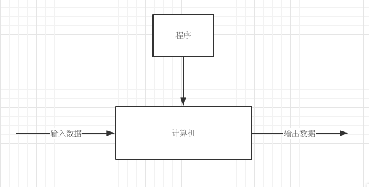
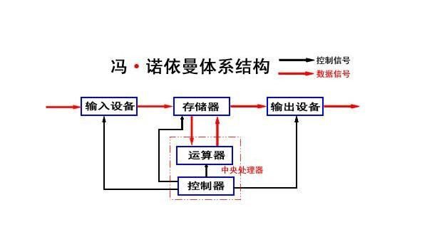
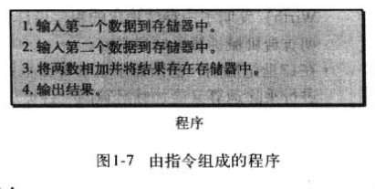

#  绪论

## 目录

- 图灵模型
- 冯诺依曼模型
- 计算机的组成
- 计算机简史
- 计算机的社会问题和职业道德问题

## 书籍介绍

中文名：计算机科学导论

原著名：Foundation of Computer Science

作者:  [美]Behrouz Forouzan 

## 图灵模型

**什么是图灵机？**

- Alan Turing 1937年首次提出通用计算机设想：所有计算都可以能在一种特殊的机器上执行
- 是一种数学上的描述
- 不是一台真实的机器

图灵模型可以称为可编程的数据处理器

程序也可以说是计算机对数据处理的指令集合

图通用灵机是对现代计算机的首次描述，该机器只要提供合适的程序就能做任何运算

## 冯诺依曼模型

基于通用图灵机建造的计算机都是在存储器（内存，寄存器）中存储数据，鉴于程序和数据在逻辑上是相通的，因此程序也能存储在计算机的存储器中，因为程序是告诉计算机对数据进行处理的指令集合，指令在逻辑上与数据相通，也都是高低电平

### 4个子系统

#### 存储器

存储器是用来存储的区域，在计算机的处理过程中存储器用来存储数据和程序，下文将会阐述存储原理

#### 算数逻辑单元（ALU）

算数逻辑单元是用来进行数字计算和逻辑运算的地方

#### 控制单元

控制单元是对存储器，算数逻辑单元，输入/输出等子系统进行控制操作的单元

#### 输入/输出单元

输入子系统负责从计算机外部接收输入数据，输出子系统负责从计算机处理结果输出到计算机外部

### 存储的程序概念

冯诺依曼模型中要求程序必须存储在内存中，早期的计算机结构只有数据在存储在存储器中，完成某一任务的程序是通过操作一系列的开关或改变其配线来实现的。

现代计算机的存储单元主要用来存储数据以及其响应数据，这意味着数据和程序应该具有相同的格式，因为他们都粗处在存储器中，实际上他们都是以`位模式`（也就是大家常说的0和1）存储在内存中

### 指令的顺序执行

一段程序是有一组数量有限的指令组成，指令按顺序执行，尽管一条指令可能会请求控制单元跳转到前面或后面的指令执行，但是这并不意味着指令没有按顺序执行，**当今的计算机以最高效的顺序来执行程序**

## 计算机的组成

计算机由三大部分组成

- 计算机硬件
- 计算机软件
- 数据

### 计算机硬件

当今的计算机硬件基于冯诺依曼模型，共分为四部分，在第五章会详细的论述

### 数据

冯诺依曼模型清楚的定义计算机为数据处理机，它接收输入数据，处理并输出相对应的结果

#### 存储数据

存储方式全是二进制，也就是高低电平，不论是数字还是图像视频，全部是二进制

#### 组织数据

尽管数据只以位模式存储在计算机内部，但是可以通过不同形式表达出来，比如图片视频等，在11-14章会详细讲解

### 计算机软件

程序在早期的计算机中体现为对系列开关的开闭合和配线的改变，编程在数据实际开始之前是由操作员或工程师完成的一项工作

#### 必须存储程序

在冯诺依曼模型中这些程序被存储在计算机的存储器中，内存中不仅存储数据，还存储程序

#### 指令的序列

这个模型还要求程序必须是有序的指令集，每一条指令操作一个或多个数据项

下图显示了一个输入两个数据，将它们相加，最后打印出结果，这段程序包含4个独立的指令集

关于程序为什么必须由不同的指令集组成，答案是重用性，如果每一个任务的程序都是完全独立且与其他程序之间没有任何公用段，编程的工作量会大大增加

#### 算法

找到合适的指令（或指令序列）来解决问题，这种按照步骤解决问题的方法就是算法

#### 语言

从早期的机器语言（纯位模式，也就是01）到汇编语言再到现在的高级语言

计算机语言只有比较有限的符号和单词，甚至可以说与自然语言（比如英语）是无关的，只是一种符号。

#### 软件工程

一个大型 的软件开发要遵循很多的规范流程，来关系到可维护性和可修改性

#### 操作系统

计算机演变过程中，科学家们发现由一系列的指令对所有程序来说时公用的，为了使这些指令只编写一次就可以用于所有程序，操作系统的概念产生了，操作系统最初是为程序访问计算机部件提供方便的一种管理程序，现代计算机操作系统完成的工作已经多的可怕。

## 计算机简史

1950年后出现的计算机差不多都基于冯诺依曼模型，无非是速度更快体积更小成本更低，但原理几乎是相同的

**第一代计算机**

1950-1959年，计算机体积庞大，只有专家可以使用，使用真空管作为电子开关，价格昂贵

**第二代计算机**

1959-1965年，晶体管代替了真空管，体积变小且成本变低，出现了FORTRAN和COBOL这两种高级计算机语言，已经开始不太涉及到计算机结构中的具体电子细节

**第三代计算机**

1965-1975年，集成电路（晶体管、导线以及其他部件坐在一块单芯片上）更加减少了计算机的成本和大小，小型计算机出现在市场上，并且已经有开始出售的软件包了（比如会计程序）

**第四代计算机**

1975-1985年，出现了微型计算机，电子工业的发展允许整个计算机子系统做再单块电路板上，这一时期还出现了计算机网络

**第五代计算机**

1985-至今，也就是目前的计算机

## 社会问题和道德问题

### 社会问题

- 人们对电子计算机产生了依赖
- 社会公正，书中阐述的`总有一天人人都能负担的起计算机成本以及上网费`在当今基本已经实现。
- 数字化分裂，也就是说使用电子计算机的人与使用传统方式的人出现了社会割裂，比如老年人不会用健康码

### 道德问题

- 隐私问题
- 版权问题
- 计算机犯罪

## 关于计算机科学

**系统领域**

- 计算机体系结构
- 计算机网络
- 安全问题
- 操作系统
- 算法
- 程序设计语言
- 软件工程

**应用领域**

- 人工智能
- 数据库

等等
