# 数字系统

这里的数字系统是 “纸和笔的代表物”，下一章将会讲解这些数字如何存储在计算机中

## 引言

数字系统定义了如何用独特的符号的来表示一个数字，在不同的系统中数字有不同的表示方法，例如十六进制的（2A）<sub>16</sub>和八进制的（52）<sub>8</sub>表示的都是十进制的（42）<sub>10</sub>

数字系统可以分为两类

- 位置化数字系统
- 非位置化数字系统

## 位置化数字系统

数字符号所占据的位置决定了其表示的值，书上给出的案例如下，千万不要被这个长长的公式吓到，其实就是一个初高中学过的东西的表示

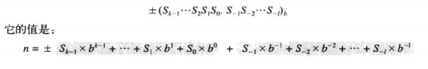

最前面的`+-`号表示有正数或是负数

其中**S是一套符号集**，**b是底（或者称为基数）**b等于S符号集中的符号总数

符号集就是对应的所有符号，比如在十进制阿拉伯数组中

```
0 1 2 3 4 5 6 7 8 9
```

就是一套符号集，他所对应的基数b就是10

S<sub>i</sub>表示该符号的位置是i

这个地方特别注意，上图给出的公式其实就是一个进制的通式，我放大一些

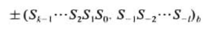

中间有一个**小数点**，用于分开小数和整数，其实就是我们在高中或者初中学过的运算方法

### 十进制

十进制的符号集是

```
S = {0,1,2,3,4,5,6,7,8,9}
```

十进制中，数字为

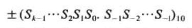

为了方便，我们通常省略加号和底

也就是把**+(552.23)<sub>10</sub>**写为552.23，就像我们平时写数字那样

我们在这里贴一个例子

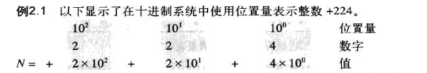

再贴一个有小数的

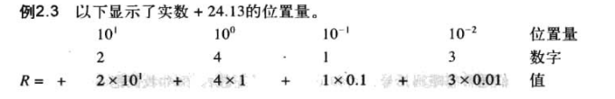

其实真的很简单

### 二进制

二进制（Binary）的符号集

```
S = {0,1}
```

我们把二进制整数表示为

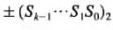

和十进制的区别就是底为2，剩下的不多赘述

整数的**二进制转十进制**转换

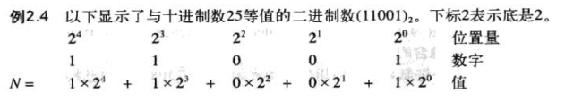

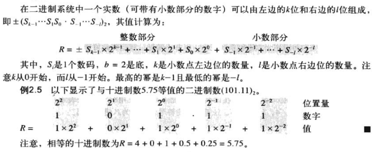

### 十六进制

尽管二进制用于存储计算机数据，但是二进制并不便于展示在计算机外部，与十进制相比，二进制过于长

十进制不能像二进制那样显示存储在计算机中的是什么

所以出现了十六进制和八进制用来解决十进制和二进制之间无显然联系的问题

十六进制(hex)的字符集

```
S = {0,1,2,3,4,5,6,7,8,9,A,B,C,D,E,F}
```

其中`A,B,C,D,E,F`分别表示`10,11,12,13,14,15`

计算公式和十进制以及二进制相同，只是b不同

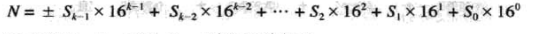

给个例子

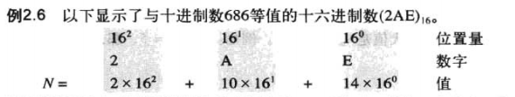

### 八进制

八进制(oct)的字符集

```
S = {0,1,2,3,4,5,6,7}
```

计算等和十六进制他们一致

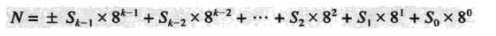

给个例子

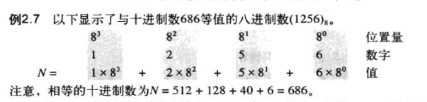

### 数码的数量

也就是数字的位数

我们通过

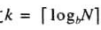

b为底

N为数字的十进制表达

这一公式计算

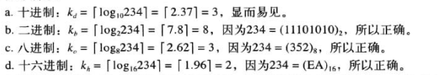

### 进制间的转换

很简单，就是一个逆向的过程

## 非位置化数字系统

非位置化数字系统并不用在计算机中

非位置化数字系统仍使用有限的数字符号，每个符号有一个值，但是符号所占位置与值无关，每个符号的值是固定的


为求出该数字的值，我们把所有符号表示的值相加

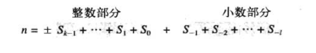