# 数据存储

## 数据类型

如今，数据以不同的形式出现，如数字、文字、音频图像和视频，人们使用不同的数据处理不同的信息


计算机工业中使用术语多媒体来定义包含数字文本图像音频和视频的信息

### 计算机内部的数据

所有计算机外部的数据类型的数据都采用统一的数据表示法转换后存入计算机中，当数据从计算机输出时再转换回来

这种通用的格式称为`位模式`

#### 位

**位**(bit)是存储在计算机中的最小单位，他是0或者1，位代表设备的某一状态

计算机使用各式各样的双态设备来存储数据

#### 位模式

为了表示数据的不同类型，应使用`位模式`，有时也成为`位流`，他是一个序列。下图展示了由16个位组成的位模式

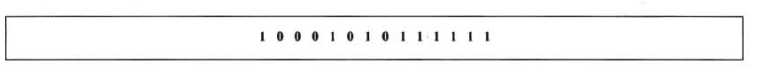

如果我们需要 1000 个位模式，每个位模式 16 位，那我就需要 16000 位

通常长度为  **8**  的位模式被称为**1个字节（Byte）**

有时候用**字（word）**来指代更长的位模式

属于不同数据类型的数据可以以同样的模式存储于内存中

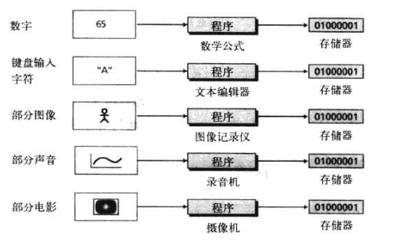

计算机存储时不管该数据是什么格式，只存其二进制内容

#### 数据压缩

为占用较少的内存空间，数据再存储到计算机之前通常会被压缩，这在第15章会讲

#### 错误检测和纠正

在附录H中讨论


## 存储数字

数字的存储存在两个问题

- 如何存储数字的符号
- 如何显示十进制小数点

对于小数点，有定点和浮点两种表示方法，定点存整数，浮点存小数

### 存储整数

定点表示法用来存储整数，在这种表示法中，小数点是假定的，不存储

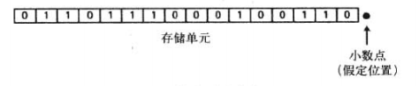

但是用户或程序可能将整数作为小数部分为0的实数存储，例如整数太大以至于无法定义为整数来存储，比如PHP的intval()函数就是有上限的

但是整数通常使用定点表示大存储在内存中

#### 无符号表示法

无符号整数也就是自然数`[0 - +∞]`

因为计算机无法表示这个范围内的所有整数，通常计算机都定义一个最大无符号整数的常量，称为最大无符号整数，值为2<sup>n</sup>-1，此处n为计算机中分配用于表示无符号整数的二进制位数，就是计算机的64位和32位

##### 存储无符号整数

1. 首先将整数变成二进制位数
2. 如果二进制位数不足n位，则在二进制整数左边补0，使其总位数为n位，如果大于n，则会发生溢出的情况

举例：将7存在8位存储单元中

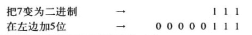

##### 译解无符号整数

先去左边补齐的0，然后将二进制转为10进制

##### 溢出

因为大小的限制，可以表达的整数范围是有限的，比如一个四位存储单元，存放了一个数值11也就是 (1011)<sub>2</sub>如果后续给这个数加上9，也就是11+9=20，就变成了(10100)<sub>2</sub>变成了五位，此时计算机会丢掉最左边的位，存入`0100` 新的整数被存为了4


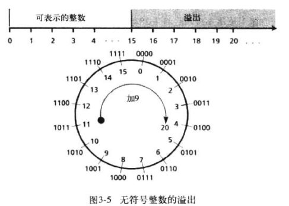

##### 无符号整数的应用

无符号整数表示发可以提高存储效率，因为不必存储整数的符号，所以所有的存储单元都可以用来存储数字

应用如下

- 计数：当我们计数时，不需要附属，从0或者1开始增长
- 寻址：有些计算机语言，在一个存储单元中存储了另一个存储单元的地址，地址都是从0（存储器的第一个字节）开始到整个存储器的总字节数的正数，在这里也同样不需要用到负数
- 为其他数据类型排序：其他的数据类型比如文本，图像等，都是以位模式存储的，可以翻译为无符号整数

#### 符号加绝对值表示法

符号加绝对值表示法用于在计算机中存储部分实数

这种方法将无符号整数的有限范围（0  -  2<sup>n</sup>-1 ）分成两个子范围

如果是存储单元n=4的4位机器，用于表示无符号整数的二进制位数为4，分开两个范围分别是0000-0111和1000-1111

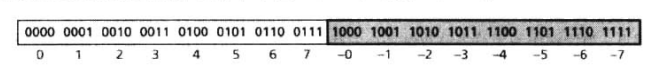

用此方式存储整数，需要用一个二进制符号位来表示符号（0正1负），这就意味着在一个八位存储单元中，可以仅用7位表示数字的绝对值，因此其数字最大上下限为[-（2<sup>n-1</sup>-1）,（2<sup>n-1</sup>-1）]

同样这样符号加绝对值表示法也会溢出，但是有正负溢出两种情况，且有+0和-0两个0

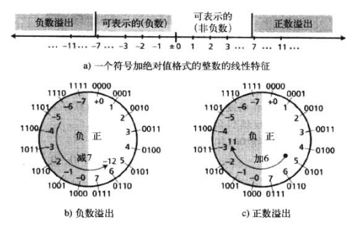

符号加绝对值表示法不用于存储整数，而用于存储部分实数，通常用来采样模拟信号

#### 二进制补码表示法

几乎所有的计算机都是用二进制补码表示法来存储位于n位存储单元中的有符号整数，这一方法中，无符号整数的有效范围也被分成两份

第一个子范围用来表示非负整数，第二个子范围用来表示负整数

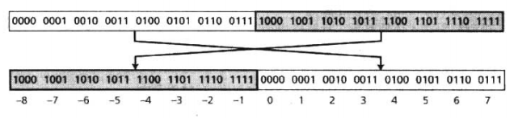

和符号加绝对值表示法一样，是0正1负，但是二进制补码表示法只有1个0

##### 两种运算

###### 反码

该运算可以应用到任何整数，不论是正的还是负的，该运算简单反转各个位，也就是把0变1，把1变0

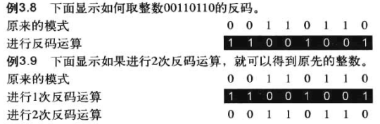

###### 补码

运算分两步

1. 从右边复制位，直到有1被复制
2. 反转其余的位

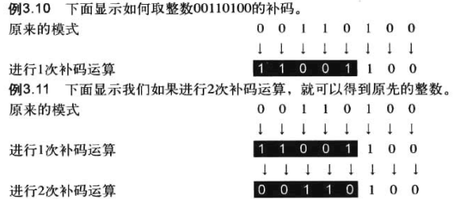

还有一种方法就是先对他进行一次反码运算然后再加上1

##### 以二进制补码格式存储整数

步骤如下

1. 将整数变成n位的二进制数
2. 如果整数是整数或0，则直接存储，如果是负数，则取其补码存储

##### 从二进制补码格式还原整数

步骤如下

1. 如果最左位是1，则取其补码
2. 将该整数转为十进制
3. 如果是取了补码，则加上符号

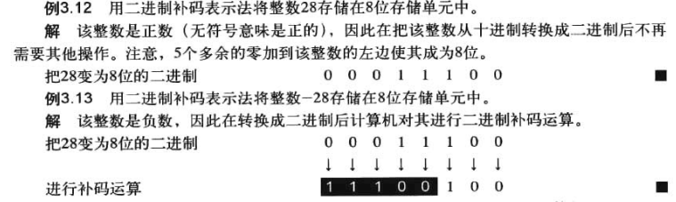

##### 二进制补码溢出

在四位存储单元的情况下，存储的整数比7大则会溢出

例如我们存入整数5，又给其加上了6，最终会显示为-5，因为5对应额度0101,加上六位二进制位1011,溢出到了负数的区间

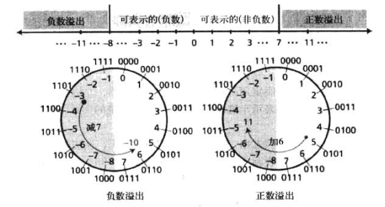

#### 三种表示法对比

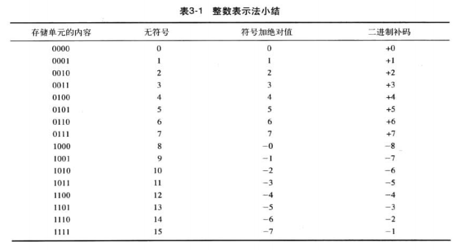

### 存储实数

实数是带有整数部分和小数部分的数字

尽管固定小数点的表示法可以用于表示实数，但结果不一定精确或达不到需要的精度

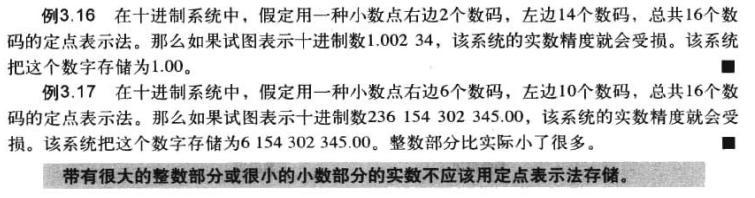

在例3.16中，1.00234的二进制表达是

```
1.0000000010011001010110101010111101111000111111101111
```

然而小数点优点只有2位，故只取到了0，所以丢失了精度

例3.17同理

#### 浮点表示法

用于维持正确度或精度的解决方法是浮点表示法，该表示法允许小数点浮动，也就是说我们可以在小数点的左右有不同数量 的数码

在浮点表示法中，无论十进制还是二进制，一个数字都由三部分组成

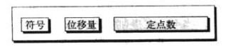

分别是

- 符号
- 位移量
- 定点数

浮点表示法在科学中用于表示很小或很大的十进制数，在称作科学计数法的表示法中，定点部分在小数点左边只有1个数码，而且位移量是10的幂次

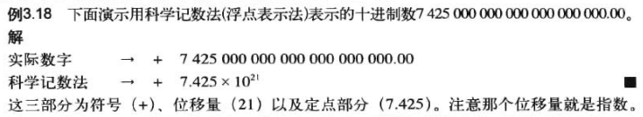

类似方法可用于表示很小或很大的二进制数字（整数实数皆可）

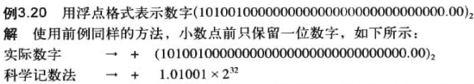

#### 规范化

为了使表示法的固定部分统一，科学计数法（十进制）和浮点表示法（二进制）都在小数点左边使用了唯一的非零数码，这称为规范化

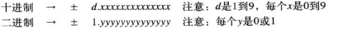

#### 符号、指数和尾数

在一个二进制数规范化后，我们只存储了该数的3部分信息

- 符号
- 指数
- 尾数

例如+1000111.0101规范化后变成

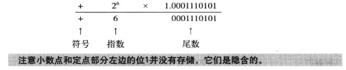

##### 符号

一个数的符号可以用一个二进制位来存储（0或1）

##### 指数

2的幂定义位小数点移动的位数，这个指数可以为正数或是负数，余码表示法是用来存储指数位数的方法

##### 尾数

尾数是指小数点右边的二进制数，它定义了该数的精度，且尾数是是作为无符号整数存储的

尾数是带符号的小数部分，像以符号加绝对值表示法存储的整数那样对待

#### 余码系统

尾数可以作为无符号整数存储，但是指数是有符号的数（左移右移正负）

尽管可以用二进制补码的方式来存储，但是被余码系统取而代之，在余码系统中，正和负都可以作为无符号数存储，为了表示正的负的整数，将正整数（称为一个偏移量）添加到每个数字中，将他们统一移到非负的一边，这个偏移量的值是**2<sup>m-1</sup>-1** 这里的m是内存单元存储指数的大小

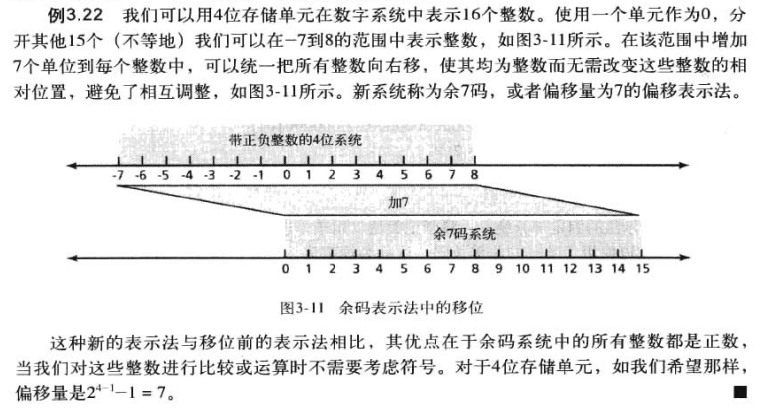

本身四位存储单元能存放的整数是0000-1111也就是十进制的0-15，此时n=4，则偏移量为7，所以我们就能表示出-7 - 8之间的数字，只需要加7就能对应到0000-1111

所以发明这玩意儿的人一定是个天才

#### IEEE标准

电气和电子工程师协会（IEEE）已经定义了集中存储浮点数的标准，在这里我们只讨论常见的 **单精度**和 **双精度**

##### IEEE的存储

如图，方框上方的数就是每一项的位数

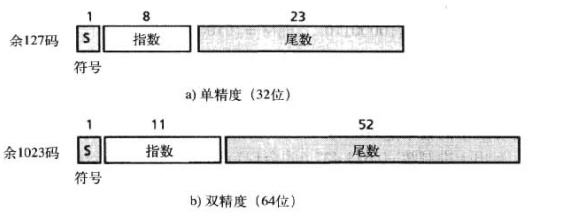

单精度需要8位存放指数因为127的二进制为1111111

双精度需要11位存放指数因为1023的二进制是1111111111

至于为什么要多一位，个人理解因为要加偏移量，而偏移量本身就已经全为1，故要多一位用来存放执行完加法后的值，加下图

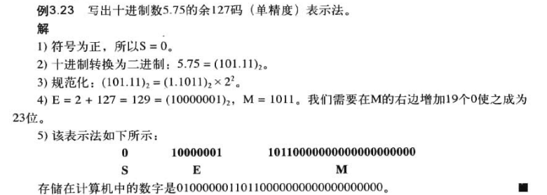

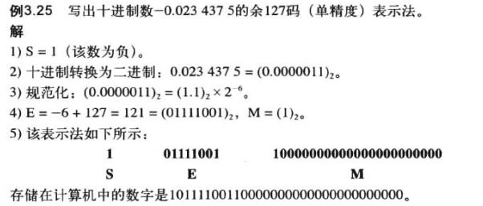

##### IEEE的还原

1. 找到S、E、M的值
2. 如果S==0则为正号
3. 找到位移量(E-127)
4. 对尾数去规范化
5. 将除去规范化的数字变为十进制求其绝对值
6. 加上符号

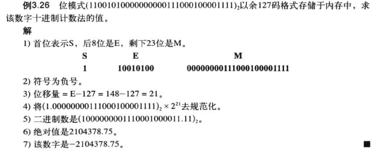

##### 上溢和下溢

对于浮点数，由上溢和下溢两种情况

下图显示了32位内存单元(余127码)的浮点表示法范围，该表示法不能存储很小或很大的绝对值

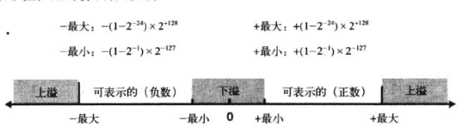

##### 存储0

为了处理这个特例，约定在种种情况下，符号指数和尾数都为0

##### 截断误差

举例说明

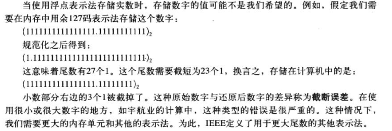

## 存储文本

在英文中使用的26个字母（A-Z,a-z,0-9）以及标点和一些比如空格，换行符制表符等

我们可以使用位模式来存储任何一个符号

比如存储一个`CATS`

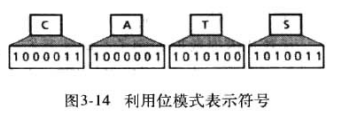

所以引出以一个问题，在一种语言中，位模式到底需要多少位来表示一个符号

位模式的尾数的长度取决于符号的数量，呈对数关系

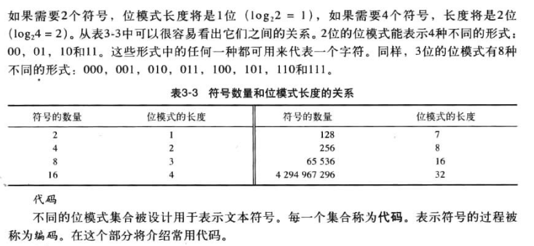

在国内通常不使用代码来称呼，所以我统一用编码来称呼

常见的编码有

- ASCII
  美国信息交换标准码，该编码使用7位表示每个符号，即可以表示2<sup>7</sup>=128种符号
- Unicode
  硬件和软件制造商联合设计出来的一种编码，使用32位，最大有2<sup>32</sup>=4294967296个字符
- 其他

## 存储音频

音频表示声音或音乐，本质上和我们讨论的数字和文本时不同的，音频首先时不可数的，是随时间变化的实体

音频是模拟数据的例子，即使我们能够在一段时间度量所有的值，也不能把他全部存在内容中，因为可能需要无线数量的内存单元

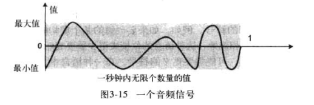


### 采样

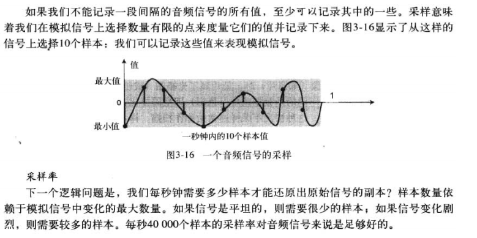

### 量化


### 编码

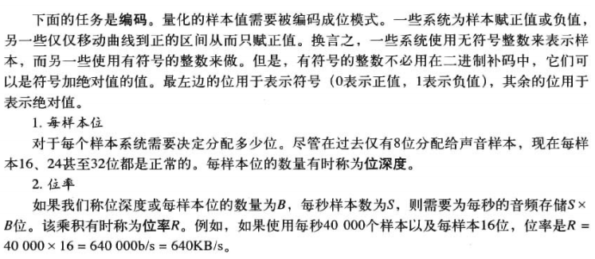

### 声音标准编码

当今主流编码标准是mp3（MPEG Layer 3），该标准是用于视频压缩放大的MPEG标准的一个修改版

## 存储图像

### 光栅图

当哦我们需要存储模拟图像时，就用到了光栅图（位图）数据密度（色彩）随着空间变化，这意味着数据需要采样

这种情况下采样通常被称作扫描，样本称为像素，整个图片被分成小的像素，每个像素有单独的密度值

#### 解析度

采样中，我们决定要对于每英寸的方块或线条需要记录多少像素，在图像处理中，我们称扫描率为解析度，如果解析度较高，人眼不会看出在重现图像中的不连续

#### 色彩深度

用于表现像素的位的数量，即色彩深度

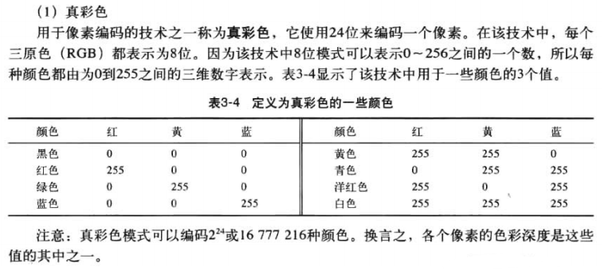

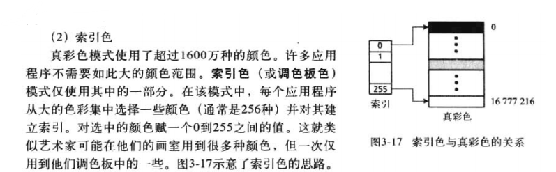


### 矢量图

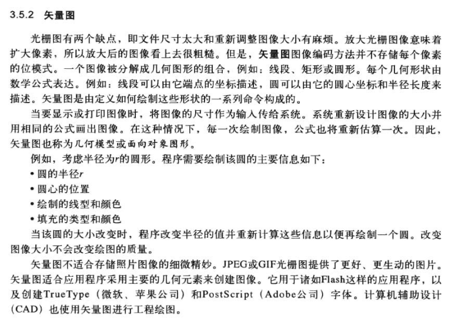

## 存储视频

视频是图像在时间上的表示（称为帧），一部电影就是一系列的帧，一张接一张的播放而形成运动的图像，与图像原理相同