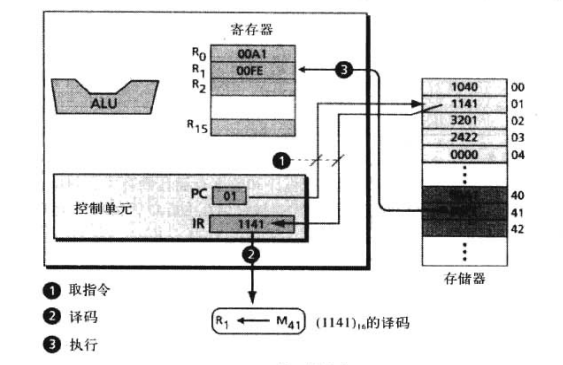

# 计算机组成

计算机组成部分可以分为三个子系统

- 中央处理单元（CPU）
- 主存储器
- 输入/输出子系统

## 中央处理单元

中央处理单元(CPU)用于数据的运算，它由三个部分组成

- 算数逻辑单元（ALU）
- 控制单元
- 寄存器组（快速存储单元）

### 算数逻辑单元

算数逻辑单元（ALU）对数据进行逻辑、移位和算数运算

#### 逻辑运算

也就是Operations on Data中间提到的与、或、非、异或

#### 移位运算

Operations on Data中间提到的逻辑位移运算和算数位移运算，主要用途是用2除或乘一个整数

#### 算数运算

Operations on Data中间提到的整数和实数的运算

### 寄存器

寄存器是用来临时存放数据的高速独立的存储单元，CPU的运算依赖于多个寄存器

#### 数据寄存器

CPU使用一些寄存器来存放运算的中间结果，在上图中，以R1-RN来命名

#### 指令寄存器

CPU的主要职责是从内存中逐条的取出指令，并将取出的指令存储在指令寄存器(IR)中，解释并执行指令

#### 程序计数器

CPU中的另一个通用寄存器是程序计数器(PC),程序计数器中保存着当前正在执行的指令，当前的指令执行完成后，计数器将自动加1，指向下一条指令的内存地址

### 控制单元

控制单元控制各个子系统的操作，控制是通过从控制单元发送到其他子系统的信号来进行

## 主存储器

主存储器是存储单元的集合，每一个存储单元都有唯一的标识，称为地址

数据以称为字的位组的形式在内存中传入和传出，字可以是8位-64位，八位称为一个字节，则32位为4个字节

### 地址空间

在存储器中存取每个字都要有相应的标识符，尽管程序员使用命名的方式来区分字（或一组字的集合），但在硬件层次上，每个字都是通过地址来标识的

所有在存储器中标识的独立的地址单元的总数称为地址空间，例如一个64KB,字长为1字节的内存的地址空间为0-65535

计算机都是以位模式存储数并进行运算，因此存储地址也是用位模式表示的

如果一个内存是64KB(65536B)=216

那么就需要16位的位模式来确定地址

起始地址通常是0000000000000000(0)

末尾地址通常是1111111111111111(65535)

通常一个计算机如果有N个字的存储空间的话，那就需要由log2N位的无符号整数来确定每一个存储单元

### 存储器的类型

#### RAM

随机存取存储器RAM是计算机中主存的重要组成部分，在随机存取设备中，可以使用存储单元地址来随机存取一个数据项，而不需要存取它前面的所有数据项

RAM和ROM都可以做随机存取，区别在于用户可读写RAM即用户可以在RAM中写信息，同时RAM断电后数据会丢失

##### SRAM

静态RAM技术是用传统的触发器门电路（有0和1两个状态的门）来保存数据，这些门保持状态，也就是说当通电时数据始终存在，不需要刷新，SRAM速度快但成本高

##### DRAM

动态RAM技术使用电容器，如果电容器充电则状态为1，放电则是0

因为电容器会随时间而漏掉一部分电，所以内存单元需要周期性刷新，DRAM速度慢但是成本低

#### ROM

只读存储器ROM的内容是由制造商写进去的，用户能读但是不能写

##### PROM

可编程只读存储器，这种存储器在计算机发货时是空白的，用户借助一些特殊的设备可以将程序存储在上面，当程序被存储后，它就会像ROM一样不能被重写，也就是说用户可以用它来存储一些特定的程序

##### EPROM

可擦除可编程只读存储器，用户可以进行编程，也可以用一些可以发出紫外光的特殊仪器对其擦写，RPROM存储器需要拆下来擦除再重新安装

##### EEPROM

通电可擦除可编程只读存储器，对它的编程和擦除只需要用电子脉冲，不需要拆下来

### 存储器的层次结构

- 对速度要求很苛刻就用寄存器这样的高速存储器
- 用适量的中速存储器来存储经常要访问的数据（高速缓冲区）
- 用大量的低速存储器来存储那些不经常访问的数据，比如主存

### 高速缓冲存储器

高速缓冲存储器的存取速度要比主存快，但是比CPU以及其内部的寄存器要慢，高速缓冲区的容量通常较小，常被置于CPU和主存之间

高速缓冲区再任何时间都含有主存中一部分内容的副本，当CPU要存取主存中的一个字时

步骤如下

1. CPU检查高速缓存
2. 如果要存取的字存在，CPU就将他复制，如果不存在，CPU从主存中拷贝一份从需要读取的字开始的内存块，该数据块将覆盖高速缓冲区的内容
3. CPU读取高速缓冲区并拷贝该字

这种方式将提高运算的速度

通常计算机花费80%的时间来读取20%的数据，相同的数据往往被存取多次

## 输入/输出子系统

分为两大类

- 非存储设备
- 存储设备

### 非存储设备

非存储设备使得CPU/内存可以与外界通信，但不能存储信息

- 键盘
- 显示器
- 鼠标
- 打印机

### 存储设备

尽管存储设备被分为输入/输出设备，但它可以存储大量的信息以备后用，比主存便宜得多，存储的信息也不易丢失，也称**辅助存储设备**

分为以下两种

- 磁介质
- 光介质

#### 磁介质存储设备

磁介质存储设备使用磁性来存储位数据，如果一点有磁性则为1

##### 磁盘

磁盘由一张一张的磁片叠加而成，由薄磁膜封装起来

信息通过盘上每一个磁片的**读写磁头**读写磁介质表面来进行读取和存储的

##### 磁带

#### 光存储设备

光存储设备是一种新技术，不过在2021年12月27日的我看来，这属实算不上什么新技术，光盘几乎已经是被淘汰的东西了

- CD-ROM 只读光盘
- CD-R     可刻录光盘
- CD-RW  可重写光盘
- DVD  数字多功能光盘

##### CD-ROM

##### CD-R

##### CD-RW

##### DVD

## 子系统的互联

下面介绍中央处理单元，主存储器和输入输出子系统是如何互联的

### CPU和存储器的链接

CPU和内存之火箭通常由称作总线的三组线路连接到一起，它们分别是

- 数据总线
- 地址总线
- 控制总线

#### 数据总线

数据总线是由多跟线组成，每一根线上每次传送1个位的数据，线的数量取决于该字的大小，例如计算机的字是32位（4个字节），那么需要有32根数据总线，一边同一时刻能够传送32位的字

#### 地址总线

地址总线允许访问存储器中的某个字，地址总线的线数取决于存储空间的带线啊哦，如果存储空间容量为2n个字，那么地址总线一次需要传送n位的地址数据，因此他需要n根线

#### 控制总线

控制总线负责再中央处理器和内存之间传送信息。

例如必须有一个代码从CPU发往内存，用于指定进行的是读操作还是写操作。

控制总线的线数取决于计算机所需要的控制命令的总数，如果计算机有2m条控制命令，那么控制总线就需要有m根，因为m位可以定义2m个不同的操作

### IO设备的连接

IO设备不饿能直接链接CPU和内存，因为输入输出设备本质与CPU内存的本质不同，输入输出设备都是些机电，磁性或光学设备，而CPU等是电子设备

IO设备比总线传输慢多了，因此必须要有中介来处理这种差异，输入输出设备是通过一种被称为**输入/输出控制器**或接口的期间连接到总线上的

常见的控制器有

- SCSI
- 火线
- USB

#### SCSI

小型计算机系统接口最初是位Macintosh系统设计的，至今还有许多系统使用

#### 火线

IEEE标准1394规定的穿行接口，俗称火线，数据采用数据包的形式传送，数据的传输速度高达50MB/S 它可以再一条菊花链或树形链接（只用一根线）上链接多达63个设备

#### USB

通用串行总线USB控制器是一种可以和火线媲美的控制器，用以链接与计算机相连的一些低俗和高速的设备

多个设备可以被连接到一个USB控制器上，这个控制器也被称为 **根集线器**，USB2允许多达127个设备同时连接到一个usb控制器上

### IO设备寻址

通常CPU常使用相同的总线在主存和IO设备之间读写设备，唯一不同的是指令

如果指令涉及主存中的字，那么数据会在主存和CPU之间传送

如果涉及IO设备，则在CPU和IO设备之间传送

#### 独立寻址

在IO独立寻址中，用来读写内存的指令与用来读写输入输出的指令是完全不同的

有专门的指令完成对输入输出设备的测试、控制以及读写操作

每个输入输出设备有自己的地址

因为指令的不同，所以输入输出地址可以和内存地址交迭而不回产生混淆

#### 映射寻址

在IO映射寻址方式中，CPU将IO控制器中的每一个寄存器都看作是内存中的某个和存储字

CPU没有单独的指令用来表示是从内存或是从输入输出设备传送数据

例如指令集中只有一条Read指令，如果地址指定的是内存中的某个单元，则从内存中读取数据，如果指定地址的是输入/输出中的某个寄存器，那么就从寄存器中读取数据

内存映射的输入/输出的配置优点在于有一个较小的指令集，所有对内存的操作指令都同样适用于输入输出设备，其缺点由于输入输出控制器占用了一部分内存地址

假使有5个输入输出设备，每个控制器有4个寄存器，则共占用20个地址，则相应的内存的大小就减少了20个字

## 程序程序

当今，通用计算机使用称为程序的一系列指令来处理数据，计算机通过执行程序，将输入数据转换成输出程序，程序和数据都放在内存中

### 机器周期

CPU利用重复的机器周期来执行程序中的指令，一步一条，从开始到结束

一个简化的周期包括3步

1. 取指令
2. 译码
3. 执行

#### 取指令

在取指令阶段，控制单元命令系统将下一条要执行的指令复制到CPU指令寄存器中，被复制指令的地址保存在程序计数器中，复制完成后，程序计数器自动加一只想内存中的下一条指令

#### 译码

该指令将由控制单元负责译码，指令译码的结果是产生一系列可以执行的二进制代码

#### 执行

指令译码完成后，控制单元发出任务命令到CPU的某个部件，例如控制单元告知系统，让它从内存中加载数据项，或者是让ALU将两个输入寄存器中的内容相加，这就是执行

## 输入输出操作

计算机需要命令把数据从IO设备传输到CPU和内存，因为IO设备的运行速度比CPU慢得多，因此CPU的操作某种程度上必须和IO设备同步

有三种方法被设计用于同步

- 程序控制IO
- 终端控制IO
- 直接存储器存取IO（DMA）

### 程序控制IO

CPU等待IO设备

CPU和IO设备之间的数据传书是通过程序中的指令实现的，当CPU遇到一条IO指令时，它就停止工作直到数据传输完毕

这种方法每当一个单元数据被传输时，CPU都要浪费时间去查询IO设备的状态

数据在输入输出操作后被传送到内存，在输出操作前要从内存中取出

### 中断控制IO

在中断控制输入输出中，首先CPU告知IO设备开始传输，但是CPU并不需要不停的查询IO设备的状态，当IO设备准备好时，通知（中断）CPU，在未准备好的时间里，CPU可以做其他工作

数据在输入输出操作后被传送到内存，在输出操作前要从内存中取出

### 直接存储器存取IO（DMA）

第三种传输数据的方法时直接存储器存取IO（DMA），这种方法用于在高速IO设备间传输大量的数据块，例如磁盘，内存（不需要通过CPU的数据传输）

这种方法需要一个DMA控制器来承担CPU的一些功能，DMA控制器中由寄存器，可以在内存传输前后保存数据块

这种方法里，CPU发信息给DMA，这些信息包括传输类型（输出or输出）、内存单元的启示地址以及传输的字节数，之后CPU就可以继续做其他工作了

当准备好传输数据时，则由DMA控制器通知CPU它需要获得总线的使用权，这时CPU停止使用总线并将总线交给DMA控制器使用，在内存和DMA间的数据传输完成后，CPU继续进行正常操作

CPU仅在DMA和内存间传输数据时才空闲，而不是设备为传输数据做准备时

但是数据传输时，CPU无法访问主存

这种方式被称为停止CPU访问主存，还有周期挪用等方式实现DMA，这个将会在计算机组成原理的章节细讲

## 不同的体系结构

本章介绍一些前面讲过的简单计算机体系结构所不同的常见的体系结构和组织

### CISC

CISC是 **复杂指令集计算机**(Complex Instruction Set Computer)

设计策略是使用大量的指令，包括复杂指令

和其他设计相比，CISC中进行程序设计要比在其他设计中容易的多，因为每一项简单或复杂的任务都有一条对应的指令

指令集的复杂性使得CPU和控制单元的电路非常复杂，CISC体系结构的设计者已经突出减少这种复杂性的解决方案

程序在两个层面上运行，CPU不直接执行机器语言指令，CPU只执行被称为微操作的简单操作，复杂的指令被转化为一系列简单的操作然后由CPU执行，这种执行机制需要一个被称为微内存的特殊内存，它负责保存机器集中的每一个复杂执行的一系列操作，因此使用为操作的程序设计被称为微程序设计

CISC体系结构会增大一些开销，但是使得机器层上的程序更简洁

英特尔开发的奔腾处理器便是CISC体系结构的

### RISC

RISC是 **精简指令集计算机**(Reduce Instruction Set Computer)

设计策略是使用少量的指令完成最少的简单操作，复杂指令用简单指令子集模拟

在RISC中进行程序设计比在其他设计中更难更费时，因为复杂指令都用简单指令来模拟

### 流水线

上文提到，计算机对于每条指令使用取指令、译码和执行三阶段，在早期计算机中，每条指令这三个阶段需要串行完成

指令n需要在指令n+1开始它的阶段之前完成它的所有阶段之前所有阶段，现在计算机使用称为流水线的技术来改善吞吐量（在单位时间内完成的指令总数），流水线的理念是如果控制单元能同时执行两个或三个阶段，那么下一条指令就可以在前一条指令执行完成前开始

当然流水线并不像这么简单，当遇到转移指令时，就会出现一些问题，在 **管道**中的指令应该被丢弃，当代新的CPU的设计在最大程度上克服这些缺点，有些CPU甚至能同时进行多个取指令周期

### 并行处理

计算机传统上有

- 单个控制单元
- 单个算数逻辑单元
- 单个内存单元

随着技术的进步和计算机硬件成本的下降，计算机如今拥有多个控制单元，多个算术逻辑单元和多个内存单元的计算机，这个思想称为并行处理，像流水线一样，并行处理能改善吞吐量

并行处理设计多种不同的技术，并行处理的总体视图是分类法

#### SISD（单指令流，单数据流）

**单指令流，单数据流**组织表示计算机有一个控制单元和一个算术逻辑单元和一个内存单元，指令被顺序执行，每条指令可以存取数据流中的一个或多个数据项，上文提到的简单计算机就是SISD

#### SIMD(单指令流，多数据流)

**单指令流，多数据流**组织表示计算机有一个控制单元和多个处理单元和一个内存单元，所有处理单元从控制单元接收相同的指令，但在不同的数据项上操作

同时操作于一阵列数据的处理器阵列就是属于这一类的

#### MISD（多指令流，单数据流）

**多指令流，单数据流**体系结构是输入多个指令流的多个指令作用于一相同的数据项的体系结构，它从未被实现过

#### MIMD(多指令流，多数据流)

多指令流多数据流作用域多个数据流（每天指令作用域一个数据项），在这种体系结构中，可以同时执行多个任务，这个体系结构可以使用单个的共享内存和多个内存区

## 简单计算机

我们引入一台简单计算机，其包含三部分

- CPU
- 存储器
- IO子系统

### CPU

CPU本身分为三部分

- 数据寄存器
- 算数逻辑单元（ALU）
- 控制单元

#### 数据寄存器

计算机中有16个16位的数据寄存器，他们的十六进制地址为(0,1,2,......,F)，我们称它们为R0-R15，在大多数指令中，它们含有16位数据，但在有些指令中，它们可能含有其他信息

#### 控制单元

控制单元具有电路，控制ALU的操作、对内存的读取和对IO子系统的存取

控制单元有两个专用寄存器

- 程序计数器
- 指令寄存器

程序计数器保存的是下一条将被指令的指令的地址

指令寄存器保存的是当前正在执行的指令

### 主存

主存有256个16位的存储单元，二进制的地址为(00000000到11111101)2 或者是十六进制的(00到FD)16，主存中既有数据，又有程序指令，前64个存储单元(00-3F)16被专用于程序指令。

任何程序的程序指令都存储在连续的内存单元中

### IO子系统

在本次的简单计算机中，有一个非常原始的IO子系统，一台键盘和一台显示器

子系统是内存地址方式的一部分，这些设备有内存映射地址，假设键盘和显示器像内存单元一样，内存地址分别为(FE)16和(FF)16,作为内存单元与CPU进行交互

### 指令集

简单计算机具有16条指令集合的能力

每条计算机指令由两部分构成

- 操作码(opcode)
- 操作数(operand)

操作码指明了在操作数上执行的操作的类型

每条指令由16位组成，被分成4个4位的域，最左边的域也就是前四位含有操作码，其他三个域含有操作数或操作数的地址

不是每条指令都需要三个操作数，任何不需要被操作的操作域填0

如果使用地址(FE)16作为LOAD指令的第二个操作数，那么简单计算机就可以从键盘取得输入

如果使用地址(FF)16作为STORE指令的第二个操作数，那么简单计算机就可以将内容输出到显示器

### 处理指令

像大多数计算机一样，简单计算机使用机器周期，一个周期由三个阶段，分别是

- 取指令
- 译码
- 执行

#### 取指令

从PC(程序计数器)中取到指令地址，然后从内存中取得指令，存入IR(指令寄存器)中

然后PC+1，指向下一条指令

#### 译码

IR中的指令被译码，所属的操作数从寄存器或内存中找到

#### 执行

指令被执行，执行结果放入合适的内存单元或寄存器中，执行结束后开始新的周期，直到遇到HALT指令

### 举例

展示整数A+B=C的过程

假设整数是二进制补码的形式

我们将AB两个整数放入寄存器中，假设在寄存器(R0,R1)中

操作的结果存放在第三个寄存器R2中

ALU只能操作存储在CPU数据寄存器中的数据，但是大多数计算机的CPU只有有限的寄存器，因此我们还是假设这两个整数被存放在内存(40)16和(41)16中

完成这个简单加法需要五条指令

在简单计算机的语言中，这五条指令被译码为

#### 存储程序和数据

我们将指令存在(00,01,02,03,04)16中

我们将数据存放在(40,41,42)16中

为什么数据从40开始，请参照上文主存的介绍

#### 指令周期

此程序共五条指令，因此需要五个指令周期，每个周期包括取址，译码，执行三个步骤

**假设运算时161 + 254 = 415**

也就是(00A1)16 + (00FE) 16= (019F)16

##### 周期1

PC指向第一条指令，在(00)16中

执行以下步骤

1. 控制单元取出在(00)16中的指令，放入IR中，PC值加一
2. 控制单元译码取到的指令(1040)16为R0<-M40
   翻译过来就是`LOAD R0 M40`将M40地址的数据存在R0
3. 控制单元执行命令

​	

##### 周期2

和周期1相同，只是取了不同的地址放入不同的寄存器

##### 周期3

此处我们已知了操作方式和第一个操作数，我们不需要将第二个操作数存放到寄存器，只需要执行加法并存入第三个寄存器即可

##### 周期4

将运算完存在寄存器中的结果存入内存中

##### 周期5

这一步让计算机停止

#### 另一个带键盘和显示器的例子

该操作大致为

最终程序被编写成

