# 操作系统

## 引言

操作系统（operating system，简称OS）是管理[计算机硬件](https://baike.baidu.com/item/计算机硬件/5459592)与[软件](https://baike.baidu.com/item/软件/12053)资源的[计算机程序](https://baike.baidu.com/item/计算机程序/3220205)。操作系统需要处理如管理与[配置](https://baike.baidu.com/item/配置/2394679)[内存](https://baike.baidu.com/item/内存/103614)、决定[系统资源](https://baike.baidu.com/item/系统资源/974435)供需的优先次序、控制[输入设备](https://baike.baidu.com/item/输入设备/10823368)与[输出设备](https://baike.baidu.com/item/输出设备/10823333)、操作网络与管理[文件系统](https://baike.baidu.com/item/文件系统/4827215)等基本事务。操作系统也提供一个让用户与系统[交互](https://baike.baidu.com/item/交互/6964417)的操作界面。

**设计目标**

- 有效地使用硬件
- 容易的使用资源

基于上面的定义，操作系统为其他程序提供支持，比如负责把其他程序装入内存

但是操作系统也是程序，它也需要被存入内存和运行，这个问题的解决方法

如果使用ROM技术把操作系统存储在内存中，这个问题就鞥解决，CPU的程序计数器可以被设置为这个ROM的开始处，当和计算机被加电时，CPU从ROM中读取指令

如今的解决方案采取两阶段

很小一部分内存由ROM构成，其中存有称为 **自举程序**的小程序，当计算机被加电时，CPU计数器被设置为自举程序的第一条指令，并执行程序中的指令，这个程序唯一的职责就是把操作系统本身（需要启动计算机的部分）装入RAM

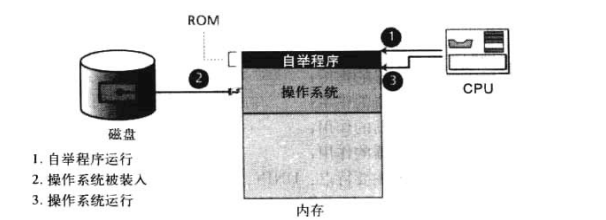

## 演化

### 批处理操作系统

批处理操作系统目的是为了控制大型计算机，当时计算机用穿孔卡片输入数据，用行式计算机输出结果

### 分时系统

多道程序的概念被引入，将多个作业同时装入内存，并且仅当该资源可用时分配给需要它的作业，例如一个程序正在使用IO设备时，CPU则空闲，可以给其他程序使用

多道程序带来了分时的概念，资源可以被不同的作业共享，每个程序可以分到一段时间来使用资源

分时技术极大地改进了计算机的使用效率，但是他们需要有一个更加复杂的操作系统，它必须可以调度，给不同的程序分配资源，并决定哪一个程序什么时候使用哪一种资源，在现在计算机中，一个新的术语“进程”产生了，一个作业是一个要运行的程序，一个进程则是在内存中等待分配资源的程序

### 个人系统

当个人计算机产生后，需要有一类适合这类计算机的操作系统，于是单用户操作系统就应运而生了，例如DOS系统

### 并行系统

人们对更快和更有效的需求催生了并行系统，在同一计算机中安装多个CPU，每个CPU可以处理一个程序或者程序的一部分，这意味着很多任务可以并行完成而不再是穿行处理

### 分布式系统

随着网络化和网络互联的发展，扩大了操作系统的内涵，可以由多个远隔千里的多台计算机共同完成

### 实时系统

实时系统是指在特定时间限制内完成任务，他们被应用在实时应用程序中，这些应用程序监控、相应或控制外部过程或环境

## 组成部分

现在的操作系统十分复杂，他必须可以管理系统中的不同资源

现代操作系统至少具有以下四种功能

- 内存管理器
- 进程管理器
- 设备管理器
- 文件管理器

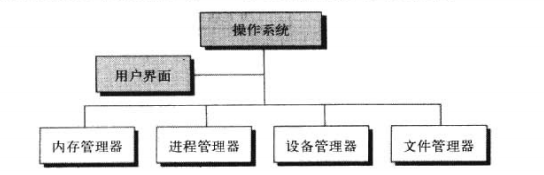

### 用户界面

每个操作系统都有用户界面，指用来接收用户（进程）的输入并向操作系统解释这些请求的操作

一些操作系统，如UNIX,LINUX的用户界面被称为命令解释程序(Shell)，在其他的操作系统中，则被称为窗口，以知名它是一个由菜单驱动的并有着GUI的部件

### 内存管理器

现代操作系统的一个重要职责就是内存管理，计算机中存储器的容量剧增，要处理的数据也越来越大，内存分配必须进行管理以避免出现溢出的情况

#### 单道程序

已经被淘汰，但可以作为例子学习

在单道程序中，大多数内存用来装载单一的程序，仅仅一小部分用来装载操作系统，在这种配置下，整个郑旭被装入内存运行，运行结束后，程序区域由其他程序替代

存在的问题如下

- 程序必须能够装入内存，如果内存容量比程序小，那么程序无法执行
- 当一个程序正在运行时，其他程序不能运行

#### 多道程序

在多道程序下，同一时刻可以装入过个程序并能够同时被执行

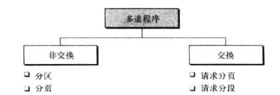

##### 分区调度

多道程序的第一种技术称为分区调度，在这种模式中，内存被分为不定长的几个分区

每个部分或分区保存一个程序，CPU在各个程序之间教体服务，它由一个程序开始，执行一些指令，直到由输入/输出操作或者分配个依程序的时限到达位置。

CPU保存最近使用的指令所分配的内存地址后转入下一个程序。对下一个程序采取同样的步骤反复执行下去

CPU也可以进行优先级管理

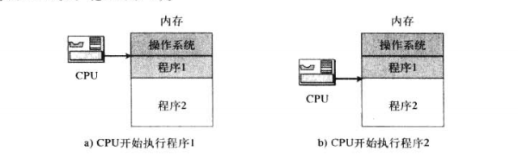

这种模式下，每个程序完全载入内存，并占用连续的地址

缺点如下

- 分区的大小必须由内存管理器你预先决定，如果分区笑了，有的程序就不能载入内存，分区大了就会产生浪费
- 随着新程序的交换载入内存后会出现空闲区
- 空闲区过多时，内存管理器能够紧缩分区并删除空闲区和创建分区，但这会增加系统的额外开销

##### 分页调度

分页调度提高了分区调度的效率，在分页调度下，内存被分为大小相等的若干个部分，称为**帧**，程序则被分为大小相等的部分，称为**页**，页和帧的大小通常是一样的，并且与系统用于从存储设备中提取信息的块大小相等

比如一个5页的程序，只需要五个不需要连续的帧即可载入内存，大大的提高效率，但是这种仍需要把整个程序载入内存

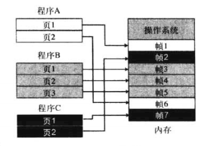

##### 请求分页调度

在请求分页调度中，程序被分为页，但是页可以一次载入内存、运行，然后被另一个页代替

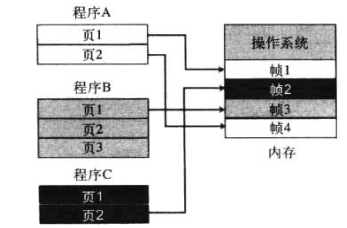

这样暂时不用的页可以不装进内存中

##### 请求分段调度

程序按照程序员的角度划分成段，被载入内存中，执行，然后被来自同一程序或其他程序的模块所替代

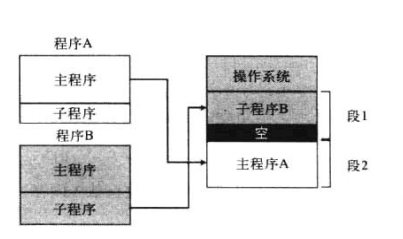

##### 请求分页和分段调度

请求分页和分段调度结合了两者的有点以提高系统效率，一个段也许太大而不能载入到内存中的空闲区，内存可以分成很多帧，一个模块可以分成很多页，依次装入内存运行

#### 虚拟内存

也就是SWAP，请求分页调度和请求分段调度意味着当程序运行时，一部分程序驻留在内存中，一部分则放在硬盘上

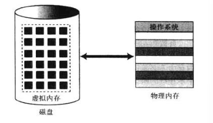

### 进程管理器

#### 程序、作业和进程

- 程序是由程序员编写的一组稳定的指令，存放在硬盘上
- 一个程序被选中执行，到其运行结束并在此称为一个程序的这段过程中，该程序称为作业
- 进程是一个执行中的程序，改程序开始执行但还未结束

#### 状态图

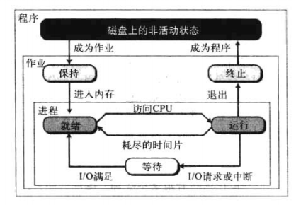

当一个程序被操作系统选中时就成为了作业并成为 **保持状态** 

当内存可以整体或者部分被载入内存时，作业变成 **就绪状态** ，并变成进程

进程在内存中保持就绪状态直到CPU运行它，这是它变为**运行状态**

当处于运行状态时，可能出现以下三种情况

- 进程运行至需要I/O资源，进入**等待状态**
- 进程可能好近所分配的时间片，进入 **终止状态**
- 进程终止

进程状态转换如下

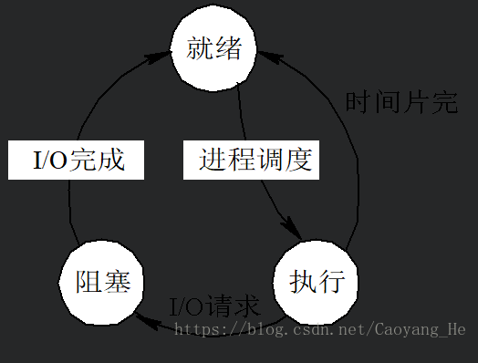

#### 调度器

将一个作业或进程从一个状态改变为另一个状态

进程管理器使用了两个调度器

- 作业调度器
- 进程调度器

##### 作业调度器

作业调度器将一个作业从保持状态转入就绪，或者是从运行转入终止

作业调度器负责从作业中创建和终止一个进程

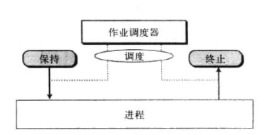

##### 进程调度器

进程调度器将一个进程从一个状态转入另一个状态。

当一个进程等待某事发生时，它使这一进程从运行状态进入等待状态

当事件发生时，进程从等待状态转入就绪状态

当一个进程所分配的时间片用完时，这个进程从运行状态进入就绪状态

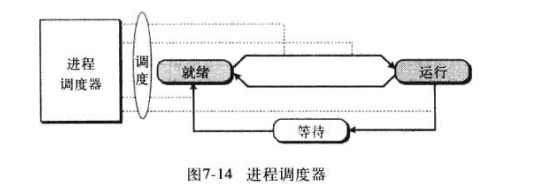

##### 其他调度器

一些操作系统使用其他类型的调度器使进程之间的转换更为有效

#### 队列

状态图显示了一个作业或进程从一个状态进入另一个状态

事实上会有很多的作业和进程互相竞争计算机资源，为处理多个进程和作业，进程管理器使用队列（等待列表）。与每一作业或进程相关的是存有这些作业和进程信息的作业控制块或进程控制块。

一个操作系统有很多个队列，如图作业和进程在三个队列里循环

- 作业队列
- 就绪队列
- IO队列

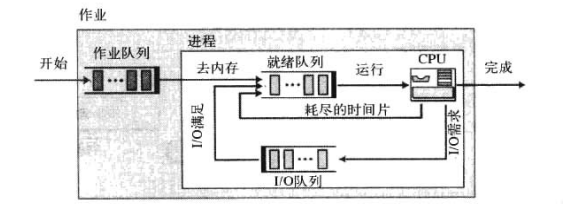

进程管理器可以用多种策略从队列中选择下一个作业或进程，比如先来先服务，最短服务时间优先，最高优先级等

#### 进程同步

所有的进程管理的思想都是使得拥有不同资源的不同进程同步，只要资源可以被多个用户同事使用，那么他可能出现两种问题

- 死锁
- 饥饿

##### 死锁

假设有进程AB

A占用File1，同时需要请求File2

B占用File2，同时需要请求File1

这个时候就产生了死锁

因为File1，2都已经被占用，如果获取不到，AB也不会释放当前占有的File1,2

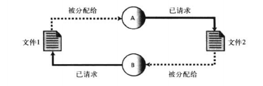

死锁产生的四个必要条件

- 互斥，一个资源只能被一个进程占有
- 资源占有，一个进程占有一个资源，即使在获取其他资源之前无法使用他
- 资源抢占，操作系统无法临时对资源重新分配
- 循环等待，所有进程和资源包含在一个循环里，如上图

如果上述条件缺少一个，则死锁不会发生

##### 饥饿

饥饿与死锁相反，发生在操作系统对进程分配资源由太多限制的时候

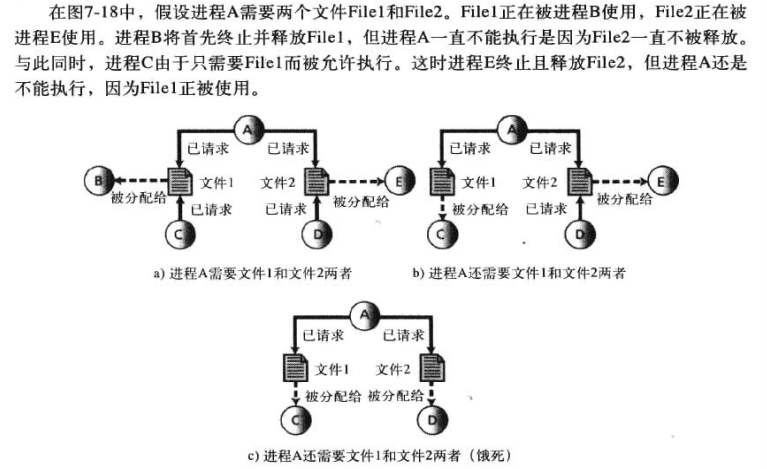

经典饥饿问题由哲学家进餐问题

五个哲学家围坐在一个圆桌前，每个哲学家需要用两只筷子吃碗里的米饭，然而有一只筷子可能被邻座的人使用了，如果没有两只筷子同时可用，则会被饿死

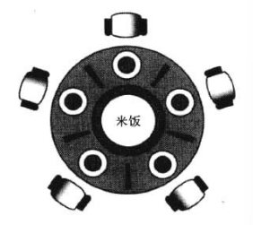

### 设备管理器

设备管理器，也可以说是IO管理器，负责访问IO设备，在计算机中IO设备存在着数量和速度上的限制，速度上比CPU和内存来说慢很多，所以当一个进程访问IO设备时，其他进程不可以使用IO设备，**设备管理器负责让IO设备使用起来更有效**

### 文件管理器

文件管理器的主要功能

- 控制文件访问
- 文件的创建，删除和修改
- 文件的命名
- 管理文件的额存储
- 归档和备份

## 主流操作系统

### Unix

Unix时多用户、多道程序、可移植的操作系统，被设计用来方便变成、文本处理和通信

Unix由四个主要部分构成

- 内核
- 命令解释器
- 一组标准工具
- 应用程序

这些组成显示在下图中

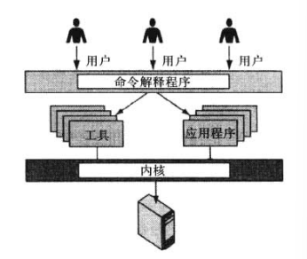

### Linux

Linux包含

- 内核，用于所有属于内核的职责，如内存管理等
- 系统库，一组被应用程序所使用的的函数，比如命令解释器
- 系统工具，使用系统库提供的服务

### Windows

微软的操作系统
