# 算法

## 概念

算法是一种逐步解决问题或完成任务的方法

算法接收一组输入数据，产生一组输出数据

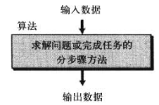

### 示例

比如在一组任意整数中找出最大值，且算法的计算与整数的数量无关

这是一个极其简单的算法，书上讲的过于啰嗦，一张图足以表示过程

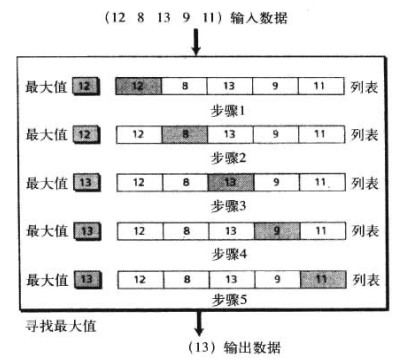

我们将其动作细分出来

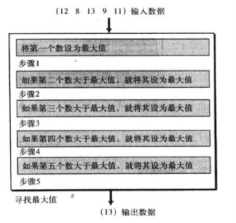

但是这个步骤仅仅支持5个数字，我们要将其 **泛化** 让其支持任意个整数

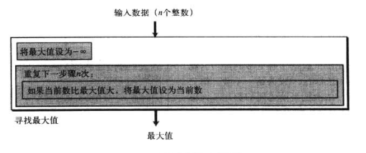

## 三种结构

结构化程序有三种结构

- 顺序
- 循环
- 判断

其他的结构是不必要的

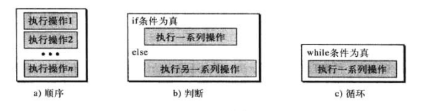

## 算法的表示

我们这里介绍UML和伪代码两种工具

### UML

统一建模语言(UML)是算法的图形表示法，它使用大图掩盖了算法的所有细节，只显示流程

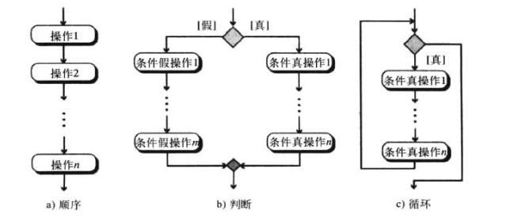

### 伪代码

伪代码是算法的一种类似英语的表示法

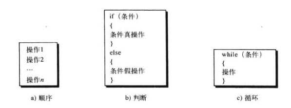

下位用伪代码写出两个整数之和的算法


## 更正式的定义

算法：算法是一组明确步骤的有序集合，它产生结果并在有限的时间内终止

## 基本算法

### 求和

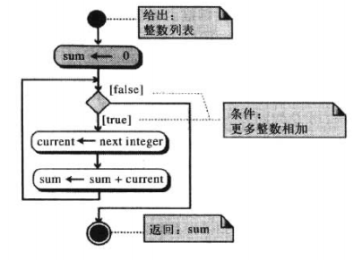

### 乘积

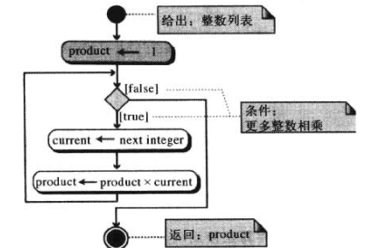

### 最大最小

见开头的算法

### 排序

#### 选择排序

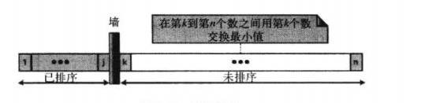

排序过程

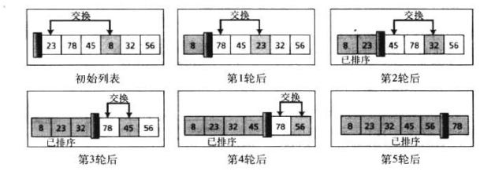

UML图

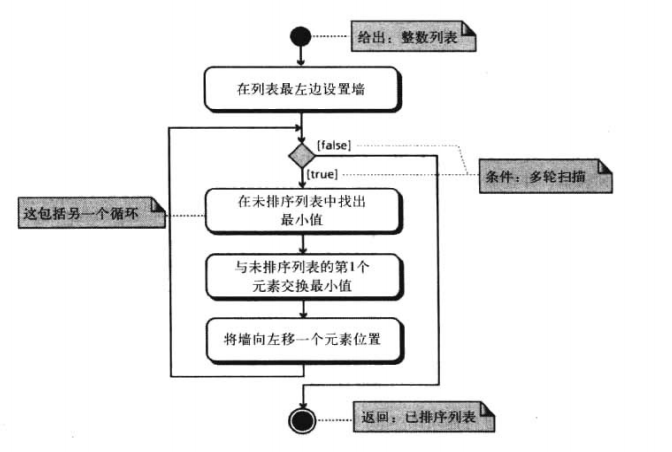

Python代码实现

```python
def select_sort(alist):
    for j in range(len(alist) - 1):
        min_num = j
        for i in range(j,len(alist)):
            if alist[i] < alist[min_num]:
                min_num = i
        alist[j], alist[min_num] = alist[min_num], alist[j]
```

#### 冒泡排序

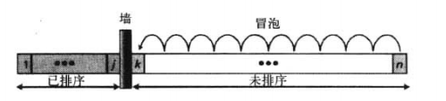

代码实现

```python
def bubble_sort(alist):
    for i in range(len(alist) - 1):
        for j in range(len(alist) - i - 1):
            if alist[j] > alist[j + 1]:
                alist[j],alist[j+1] = alist[j+1],alist[j]
```

执行结果

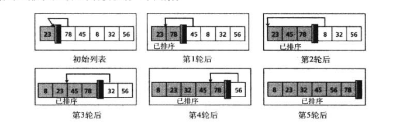

执行过程


#### 插入排序

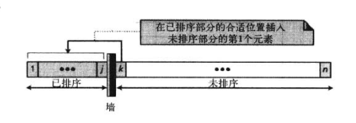

代码实现

```python
def insert_sort(alist):
    """插入排序"""
    for i in range(1,len(alist)):
        for j in range(i, 0, -1):
            if alist[j] < alist[j-1]:
                alist[j], alist[j-1] = alist[j-1], alist[j]
```


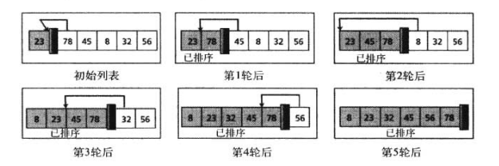

#### 其他排序

还有很多排序

- 希尔排序
- 快速排序
- 合并排序
- ......
- ..

### 查找

#### 循序查找

也就是一个一个找

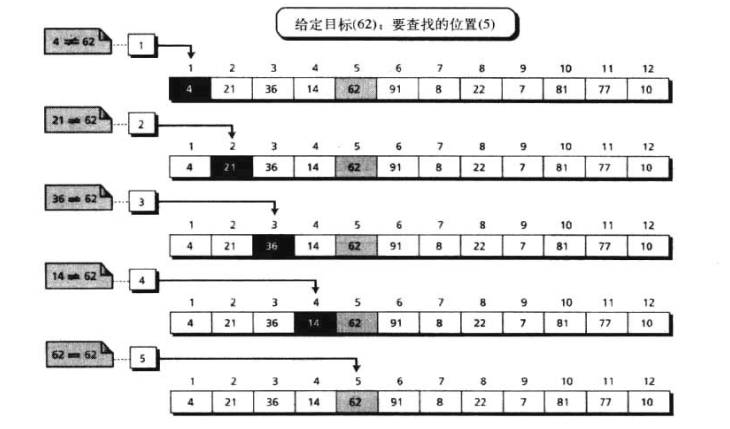

但是当数巨多的时候，就很费时间

#### 二分查找

也成折半查找，建立在有序排列的基础上

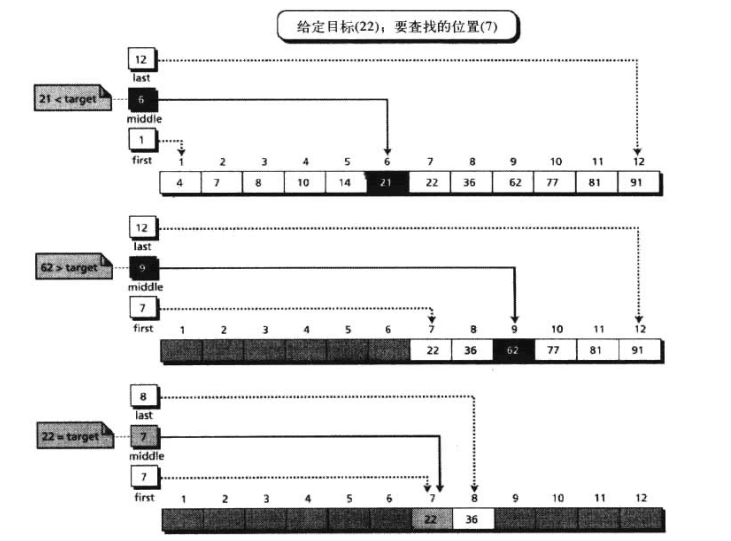

## 子算法

三层结构可以为每一个可解的问题创建算法，结构化变成是要将算法分成几个单元，称为子算法，每个自算法还可以分为更小的子算法

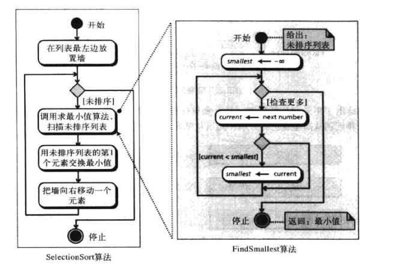

## 递归

递归是算法自我调用的过程

### 迭代的定义

考虑一个阶乘的运算，因子是从1到该整数的数

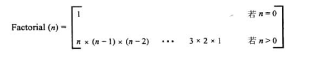

### 递归的定义

一个算法是否叫做递归，取决于这个算法中是否有他本身

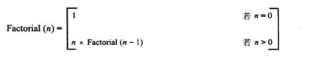

分解来看

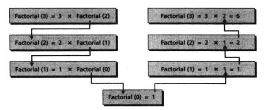

