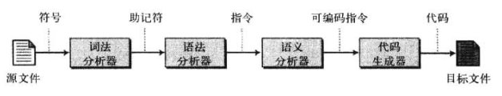

# 程序设计语言

## 演化

### 机器语言

对计算机而言，唯一的程序设计语言是机器语言，每台计算机有自己的机器语言，这种机器语言由0和1的字符串组成

在第5章中，我们十一行代码完成了两个数的加法并打印出来，也就是下图的


这些十六进制代码被转换成机器语言如下


```
计算机唯一识别的语言就是机器语言
```

### 汇编语言

用01写代码实在是一件离谱的事情，所以就用带助记符的指令和地址代替二进制代码

首先这些语言被称为符号语言，然后被称为汇编语言


### 高级语言

汇编语言虽然提高了效率，但是还是需要程序员花费大量精力在硬件上，所以产生了高级语言

高级语言通汇编语言都有一个共性，他们必须背转化为机器语言，这个过程被称为`解释`或`编译`

人们开发了各种各样的语言，比如C，Java，C++等

## 翻译

高级语言程序被称为`源程序`，被翻译成的以及语言程序被称为`目标程序`

### 编译

编译程序把整个源程序翻译成目标程序

### 解释

有些编程语言使用解释器把源程序翻译成目标程序，解释是指把源程序中的每一行翻译成目标程序中相应和行，并执行它的过程

#### 解释程序方法一

源程序的每一行被翻译成被其使用的计算机上的机器语言，该行机器语言被立即执行

如果在翻译和执行中有热河错误，过程就会显示消息，其余的过程就被终止，程序需要被改正，在此从头解释和执行

#### 解释程序方法二

分成两步

1. 编译
2. 解释

Java源程序首先被编译，创建Java的字节代码，这个代码看起来像机器语言中的代码，它是一种虚拟机的目标代码，该虚拟机被称为Java虚拟机或JVM

字节代码可以被任何运行Jvm模拟器的计算机编译或解释

### 翻译过程

编译和解释的不同在于，编译在执行前翻译整个代码，而解释一次只翻译和执行源代码中的一行



#### 词法分析器

词法分析器一个符号接一个符号的读源代码，创建源语言中的助记符表

例如w\h\i\l\e被读入，组合其他就形成了while和这个助记符

#### 语法分析器

语法分析器分析一组助记符，找出指令

例如x\=\0三个字符被读取到，就建立了x=0这个赋值语句

#### 语义分析器

语义分析器检查语法分析器创建的句子，确保他们不含有二义性

#### 代码生成器

在无二义性的指令被语法分析器创建之后，每条指令将转化为一组程序将要再起上运行的计算机的机器语言

## 编程模式

计算机语言可分四种模式

1. 过程式
2. 面向对象
3. 函数式
4. 说明式


## 共同概念

### 标识符

所有过程式语言的共同特点之一就是具有标识符（对象的名字），标识符允许给程序中数据和其他对象命名

### 数据类型

数据类型定义了一系列值以及应用于这些值的一系列操作

通常都会定义

- 简单数据类型
- 复杂数据类型

#### 简单数据类型

- 整数
- 实数
- 字符
- 布尔

#### 复合数据类型

- 数组
- 记录

### 变量

变量是存储单元的名字，每个内存单元都有一个地址，这个地址让程序员使用十分不方便

#### 变量声明

大多数语言需要提前声明变量，计算机流出要求的存储区域并命名它

```c
char c;
int num;
double res;
```

#### 变量初始化

```c
char c = 'z';
int num = 123;
```

### 字面值

字面值是程序中使用的预定义的值，比如算圆面积的pi

### 常量

常量是一个可以存储值的命令的位置，在程序开始处被定义后就不可以被改变

### 输入和输出

比如C语言中的`scanf`和`printf`

### 表达式

#### 运算符

##### 算数运算符


##### 关系运算符


##### 逻辑运算符


##### 操作数

操作数接收一个运算符的动作，对于任何一个运算符可能有1或2个或更多的操作数

比如出发运算的操作数就是被除数和除数

#### 语句

##### 赋值语句

比如x=1，将1赋值变量x

##### 复合语句

也就是一个代码块


##### 控制语句

比如goto和Jump,switch/case

以及判断循环等

#### 子程序


牵扯到的概念有

1. 局部变量
2. 参数
3. 传值


