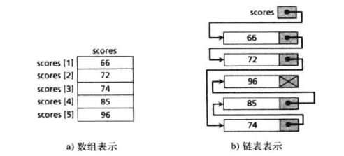
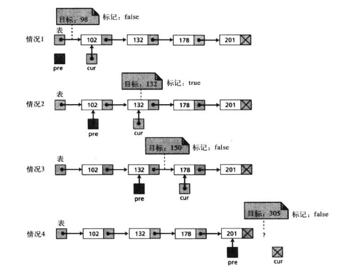
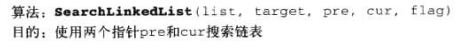
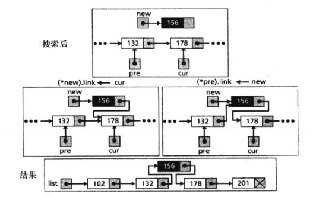
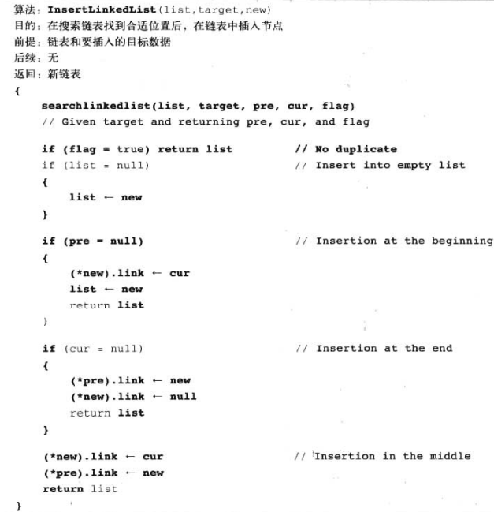
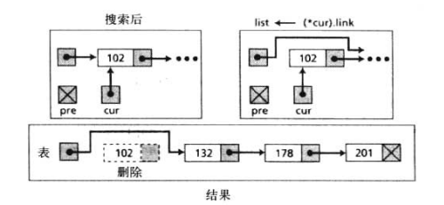
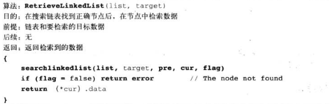
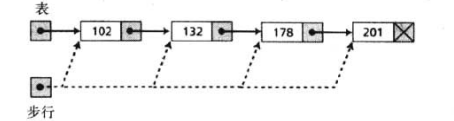

# 数据结构

数据结构利用了有关的变量的集合，而这些集合能够单独作为一个整体被访问

## 数组

假设有100个分数，我们需要读入这些数，处理它们并打印。同时还要求将这100个分数在处理过程中保留在内存中

解决这个问题可以定义100个变量，每个有不同的名字，但是这样使用太过于麻烦了


我们使用数组这个数据结构来解决这个问题

**数组**是元素的循序结合，通常这些元素具有相同的数据类型，虽然有些语言允许在一个数据中心可以有不同类型的元素


我们使用`score[0]~score[99]`来取得没一个分数

### 多维数组

最简单的就是二维数组，举例来说

```
[
[1,2],
[3,4],
[5,6]
]
```

这样的话就相当于有了一个2x3的矩阵


数组的插入，删除等不记录了，是太过于基础的东西

## 链表

我大致了扫了一遍这个导论上关于链表的内容，太浅显了

**链表**是一个有序数据的集合，其中每个元素包含下一个元素的地址；即每个元素包含两部分

也就是数据和链，数据部分用来存放数据，链部分存在链表下一个部分的地址


链表中的元素被称为节点


### 数组和链表

数组和链表的区别在于，数组存在于连续的内存地址中，而链表通过索引的方式来取得下一个节点



### 链表名和节点名


### 链表操作

#### 链表搜索

链表的搜索算法只能是顺序的

在搜索开始时，pre指针为空，cur指针指向第一个节点






#### 插入节点

##### 头插


##### 尾插


##### 中间插入





#### 删除节点

##### 删除首节点



##### 删除中间节点或尾结点


#### 检索节点



#### 遍历链表




