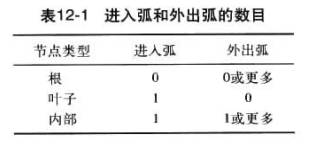

# 抽象数据类型

抽象数据类型Abstract Data Types(ADT)

## 背景

为了处理数据，我们需要定义数据类型在和数据上进行的操作

数据类型的定义和应用于数据的操作定义是抽象数据类型

### 简单的抽象数据类型

许多编程语言已经定义了一些简单的抽象数据类型作为语言的整数部分，例如C语言定义了称为整数的简单抽象数据类型。这种类型的ADT是带有预先定义范围的整数，C还定义了可以再这种数据类型上应用的集中操作（加减乘除等）

但是程序员不需要这些事如何实现的，比如两数相加

### 复杂的抽象数据类型

比如表、栈、队列等

> 抽象概念意味着
>
> 1. 知道一个数据类型能做什么
> 2. 如果去做是隐藏的

### 定义

抽象数据类型就是对该数据类型有意义的操作封装在一起的数据声明，然后用它封装数据和操作并对用户隐藏

1. 数据的定义
2. 操作的定义
3. 封装数据和操作

### 抽象数据类型的模型

抽象数据类型的模型如图


### 实现

计算机语言不提供抽象的数据类型包，要使用抽象数据类型，首先要先实现他们

## 栈

栈是一种限制线性列表，该类列表的添加和删除造作只能在一端实现，称为栈顶


### 栈的操作

尽管栈有很多种操作，但基本操作只有四种

1. 建栈
2. 入栈
3. 出栈
4. 空

#### 建栈

建栈操作创建一个空栈

```
stack(stackName)
```


#### 入栈

```
push(stackName,dataItem)
```


#### 出栈

```
pop(stackName,dataItem)
```


#### 判空

```
empty(stackName)
```

如果栈空则返回真

若栈非空则返回假

### 栈的抽象数据类型


### 栈的应用

#### 倒转数据

给定一组数据，重新按照逆序排序


#### 配对数据

比如数学运算，乘法应比加法先算

下列算法检查表达式中括号配对情况


### 栈的实现


## 队列

队列只可以从尾部插入，从头部删除，和人排队是一样的


### 队列的操作

四个基本操作

- 建队列
- 入列
- 出列
- 判空

#### 建队列

```
queue(queueName)
```


#### 入列

```
enqueue(queueName,dataItem)
```


#### 出列

```
dequeue(queueName,dataItem)
```


#### 判空

```
empty(queueName)
```

如果队列空则返回真

若队列非空则返回假

### 队列的抽象数据类型


### 队列的应用

队列是对常用的数据处理结构之一

比如把数据分成两类（大于1000和小于1000）


### 队列的实现


## 广义线性表

队列和栈都是限制线性表

广义线性表像是插入删除等操作都可以在其中任意地方进行的表，比如数据结构中提到的链表

### 广义线性表的操作

六种基本操作

- 建表
- 插入
- 删除
- 检索
- 遍历
- 判空

#### 建表

```
list(listName)
```

#### 插入

```
insert(listName,element)
```


#### 删除

```
delete(listName,target.element)
```


#### 检索

```
retrieve(listName,target,element)
```


#### 遍历

```
traverse(listName,action)
```

#### 空

```
empty(listName)
```

### 广义线性表的抽象数据类型


### 广义线性表的应用

以下为修改学生成绩的伪代码


### 广义线性表的实现


## 树

树包括一组有限的元素


我们把树中的定点分为三类

- 根
- 叶子
- 内部



从一给定节点可以直接到达的节点称为子节点

从其出发子节点可以直接到达的节点称为双亲

具有相同双亲的节点称为兄弟节点

节点的子孙是指从该节点出发可以到达的所有节点

从其出发所有的子孙都可以到达的称为祖先节点


## 二叉树

二叉树是由一颗空树或由一个根节点和两颗子树组成，而每颗子树也是二叉树


### 二叉树的操作

六种基本操作

- 建树
- 插入
- 删除
- 检索
- 判空
- 遍历

#### 二叉树的遍历

##### 深度优先遍历


##### 广度优先遍历

先处理节点的所有子节点，然后再进行下一层


上图遍历次序为ABECDF

### 二叉树的应用

#### 赫夫曼编码

赫夫曼编码是一种压缩技术，它使用二叉树来生成一个符号串的可变长度的二进制编码

#### 表达式树


### 二叉树的实现

二叉树可以通过数组或者链表来实现，但是链表实现的效率更高

## 二叉搜索树

二叉搜索树(BST)是一种具有额外特性的二叉树：每个节点的关键字值大于左子树中的所有节点的关键字值，小于右子树中所有节点的关键字值


BST有一个有趣的特性，就是如果我们对二叉树应用中序遍历，被访问的元素将以圣墟排列


更有趣的就是，这甚至可以应用折半查找


### 二叉搜索树的时限


## 图

图是由一组节点和一组顶点间的连线构成的一种抽象数据类型

图中的节点可以有一个或多个双亲


