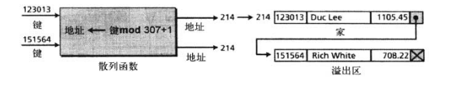

# 文件结构

## 存取方法

在设计一个文件时，关键问题时如何从文件中检索信息（一个特定的记录）

有时需要一个接一个的处理记录，有时又需快速存取一个特定的记录而不用检索前面的记录，存取方法决定了如何检索记录

### 顺序存取

如果需要顺序地存取记录，则使用顺序文件结构

### 随机存取

如果想存取某一特定记录而不用检索其之前的所有记录，则使用随机存取的文件结构

- 索引文件
- 散列文件

## 顺序文件

顺序文件是指记录只能按照顺序从头到尾一个接一个的存储，并在最后的记录加上EOF标志

处理伪代码如下

顺序存取用于需要从头到尾存取的应用，比如遍历每个职员的工资信息

然而顺序文件效率并不高，如果记录数目过多，被检测的记录靠后，则花费时间长

### 更新顺序文件

顺序文件必须定期更新，以反映信息的变化，所有记录都要被顺序的检查和更新

#### 需要更新的文件

被涉及到的文件有

- 新主文件
- 旧主文件
- 事务文件
- 错误报告文件

过程如下

- **新主文件：**新的永久数据文件通常称为新主文件，新的主文件里包含大部分当前数据
- **旧主文件：**需要被更新的永久文件，即使在更新后，也要被保留作为参考
- **事务文件：**它包含或将要对主文件做的改变，一共有三种基本类型的改变，包括添加事务、删除事务、更改事务，做这些事务需要 **键**这个文件中一个或多个能唯一标识数据的字段，类似于数据库中的主键
- **错误报告文件：**将事务中的错误报告给用户

#### 文件更新过程

要使文件更新过程有效率，所有文件都必须按照同一个键排序

## 索引文件

引出主键的概念，也就是唯一标识符

索引文件由数据文件组成，它是带索引的顺序文件，索引本身非常小，只占两个字段

- 顺序文件的键
- 磁盘上的地址

存储文件步骤如下

1. 整个索引文件都载入到内存中
2. 搜索项目，比如可以引入二分法查找
3. 检索记录的地址
4. 按照地址，检索数据记录并返回给用户

### 倒排文件

索引文件的好处之一就是可以有多个索引，每个索引有不同的键

例如职员文件可以按社会保险号或姓名来检索，这种索引文件被称为倒排文件

## 散列文件

在索引文件中，索引将键映射到地址，散列文件用一个函数来完成映射

用户给出键，函数将键映射成地址，再传送给操作系统

### 散列方法

在映射中，可以选择多种散列方法中的一种

#### 直接法

在直接散列方法中，键是未经算法处理的数据文件地址。文件必须对每个可能的键都包含一个记录

虽然用直接散列的情况很少，但他非常有用，因为它保证没有其他方法所存在的同义词或冲突问题

虽然直接散列是一个理想的方法，但是其应用十分有限

比如存放社会保险号，一共有9位，则需要一个有999999999条记录的巨大文件，而可能只用到了不到100条

#### 求模法

求模法也成为了除余散列法，求模方法用键除以文件大小后，将余数+1作为地址

#### 数字析取法

如果使用数字析取散列法，则选择从键中析取的数字作为地址

例如，从6位的员工编号中取3位地址(000-999)，可以选择第1,3,4位数字作为地址

#### 其他方法

比如平方中值法、折叠法、旋转法、伪随机法等

### 冲突

在运算中可能出现多个键对应同一个地址，我们称这些键为同义词

冲突的产生实在散列算法为插入键产生地址时，如发现该地址已经被占用，由散列算法产生的地址叫做起始地址，包含所有起始地址的区域称为主区

当两个键的起始地址冲突，必须将其中一个键的数据存放到另一个地址单元来解决冲突

#### 开放寻址

是散列冲突解决法的一种，解决了在主区的冲突，当一个冲突发生时，主区地址将查找开放或空闲的记录来用于存放新数据

最简单的是存放在下一个地址中去

#### 链表解决法

开放寻址容易增加未来冲突的可能性

在链表解决法中，第一条记录存储在起始地址，但它包含了一个指向下一条记录的指针

#### 桶散列法

桶是一个能接纳多个记录的节点。这个方法的缺点是可能有很多浪费的存储单元

#### 组合方法

有很多方法可以用来解决冲突

## 目录

目录是大多数操作系统提供的，用来组织文件

在大多数操作系统中，目录表示为含有其他文件信息的一种特殊文件类型

目录的作用不仅仅像是一种索引文件，该索引文件告诉操作系统文件在辅助存储设备上的位置，还包括关于文件的其他信息，如文件访问权限等

### Unix操作系统中的目录

#### 特殊目录

包括

- 用户主目录
- 根目录
- 工作目录
- 父目录

#### 路径和路径名

分为绝对路径和相对路径

## 文本文件与二进制文件

### 文本文件

文本文件是一个字符文件，在它们的内存储器中的格式不能包含整数，浮点数或其他数据结构

### 二进制文件

二进制文件时用计算机的内部格式存储的数据集合

