# 数据压缩

数据压缩意味着发送或是存储更少的位数，分为有损压缩和无损压缩

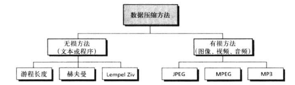

## 无损压缩

在无损数据压缩中，数据的完整性是受到保护的

原始数据与压缩和解压后的数据完全相同

我们讨论三种无损压缩方法

- 游程长度编码
- 赫夫曼编码
- LempelZiv算法

### 游程长度编码

游程长度编码也许是最简单的压缩方法，可以用来压缩由任何符号组成的数据

这种方法的大致思路是将数据中连续重复出现的符号用一个字符和这个字符重复的次数来代替

比如`AAAAAAAA`用`A08`来代替

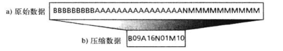

在位模式中，如果数据只用两种符号，并且一种符号比另一种符号更为频繁，那么这种压缩方法就更有效

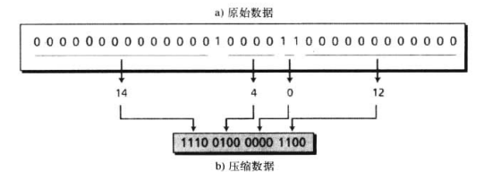

在这里我们使用4位二进制数计数，在实际中，我们应寻找一个最佳的位数来计数来避免引入额外冗余

注意:用4位二进制压缩时，如果连续的0多于15个，它们将被分为2组或者更多的组。

例如，连续的25个0编码为1111 1010。 

现在的问题则是:接收者如何知道这是25个0而不是连续15个0后接着1个1，然后再接10个0？

答案是，如果第一个计数是1111，我们就默认下一个4位模式仍然是用于表示连续0的数目。

而另一个问题又产生了:假如2个1之间刚好15个0时又怎么办呢?

这种情况下的模式是1111后再紧跟0000。

### 赫夫曼编码

在赫夫曼编码中，对于出现更为频繁的字符分配较短的编码。而对于出现较少的字符分配较长的编码，比如有一个文本文件只用到了5个字符（A,B,C,D,E）,在给每个字符分配位模式前，首先根据每个字符的使用频率给它们分配相应的权值

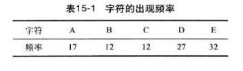

在确定了各个字符的权值之后，就可以根据这些值构造一棵树，构造树的过程如下

1. 将全部字符排成一排。每个字符都是树的最底层节点
2. 找出权值最小的两个节点并由他们合成打三个节点，产生一颗简单的二层树。新节点和权值由最初两个节点的权值结合而成，这个节点必须在叶子节点的上一层，可以再和其他的节点结合
3. 重复步骤2，直到各个层上的所有节点结合成一颗树

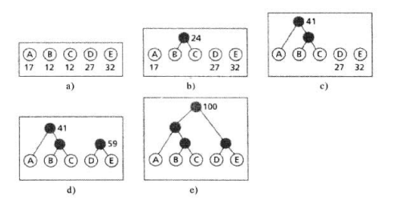

树构造完成后，利用它来给各个字符分配编码

首先给每个分支分配一位（从根节点开始），给左分支分配0，给右分支分配1

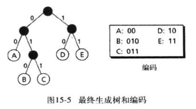

这里可以看出，任何一个节点和编码都不会是其他节点编码的前缀

比如B、C、D的前缀不会是00、10、11

#### 编码

按照上文提到的编码

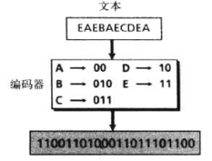

赫夫曼编码的好处就是不需要分隔符，因为任何一个节点和编码都不会是其他节点编码的前缀，不会产生二义性

#### 译码

当接收到前两位数的时候，不必知道下一个位就可以译码

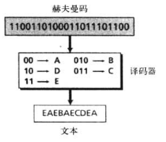

### Lempel Ziv编码

Lempel Ziv(LZ)编码是基于字典编码的一类算法的一个例子，如果接收和发送双方都有这样的字典，那么字符串可以由字典中的索引代替

但是有一些问题，比如怎样为每一个通信产生一个字典，接收方怎样接收这个字典

一个使用的算法就是LZ算法，这算法是基于字典的自适应编码的思想

使用LZ算法和简单版本，整个过程分为两个阶段

- 压缩字符串
- 解压字符串

假设我们要发送的字符串如下

```
BAABABBBAABBBBAA
```

#### 压缩

在这个阶段中，需要同时做这两件事：

- 建立字典索引
- 压缩字符串

算法从未压缩的字符串中选取最小的子字符串，这些子字符串在字典中不存在。

然后将这个子字符串，其他所有字符被字典中的索引替代，然后将索引和最后一个字符插入压缩字符串，比如ABBB，在字典中找到ABB和它的索引4，得到的就是4B

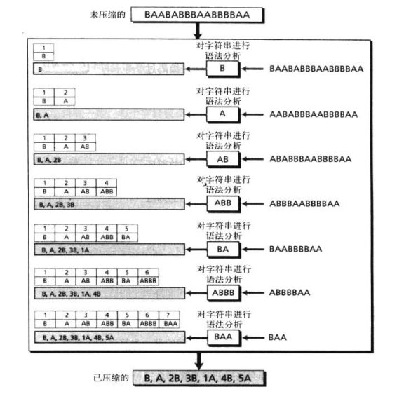

**第一步**编码过程从原始字符串中选择不在字典中的最小子字符串。因字典是空的，最
小字符串是单字符(第一个字符是B)。于是将它作为第一条记录加入字典并赋予索引值1。由
于这个子字符串不存在子串可以被字典中的索引取代的情况(因为它只有一个字符)，压缩过
程将B插入压缩字符串。至此，压缩字符串仅有一个字符B，而未压缩的字符串则由原始的字
符串中减去了第一个字符。
**第二步**压缩过程选择 下一个不在字典中的最小子字符串。这里是A,压缩过程将A作为
第二条记录加入字典。这个子字符串也不存在子串可以被字典中的索引取代(它仅有一个字.
母)。压缩过程将A加入压缩字符串。至此，压缩字符串里就有了两个字母B和A (在压缩字符
串中，相邻的子字符串之间加逗号以示隔开)。
**第三步**压缩过程继续选择下一个不在字典中的最小子字符串。此时的情况与前两步不
同，下一个字符(A)已经在字典中了，因此此时选择的字符串为AB。它在字典中并不存在，
于是将AB作为第三条记录加入字典。压缩过程发现字典里存在这个字符串除去最后一个字符的子串(AB除去最后一个字符为A),而A在字典中的索引号为2，所以压缩过程用2代替A并
将2B加入到压缩字符串中。
**第四步**接着， 压缩过程选择了ABB (因为字典中已经存在A. AB)，并将ABB作为第四
条记录加入字典，赋予索引值4。压缩过程这时发现字典里存在该子串除去最后-一个字符的子
串(AB)，其索引值为3.于是3B加入到压缩字符串中。

细心的读者也许已经注意到了，在前面的三步中，我们实际上并未实现任何压缩。因为
一个字符的码被一个所代替(第一步中A被A代替，第二步中B被B代替)，两个字符的码被两
个字符的码所代替(第三步中AB被2B代替)。但是在这一- 步当中我们确实减少了字数(ABB
变成了3B)，如果原始的字符串出现了许多这样的重复字符串(在大多数情况下该情况确实存
在)，那么我们便可以大大地减少字符的数量。
剩下的几步与前述的四步相类似。需要注意的是这里字典仅仅为编码程序用来寻找索引，
而并没有传送到接收方。实际上正如下一节所述，接收方必须自己来创建字典。

#### 解压

解压是压缩的逆过程

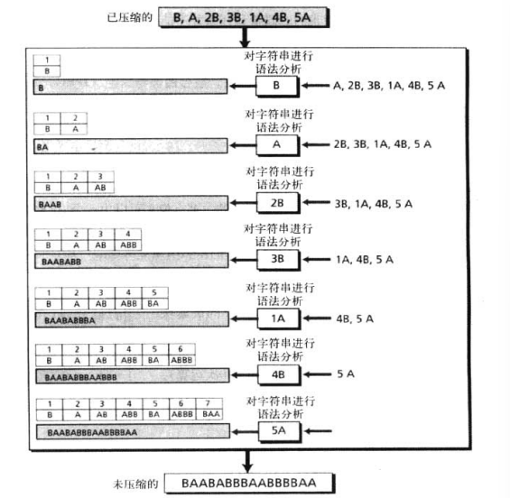

## 有损压缩

在图片，视频等文件中，信息的稍微丢失是可以接受的，比如1080p的图片变成了720p

当前有以下成熟的方法来压缩图片

- 联合图像专家组 JPEG
- 运动图像专家组 MPEG
- MPEG第三代音频压缩格式MP3

### 图像压缩JEPG

正如第二章讨论过的，一副图像可以通过一个二维数组来表示图像元素

例如640 x 480 = 307200像素

为了讨论的简单，我们假设图片是灰度的，如果一个图像是灰度的，那么像素可以由一个8位整数（256个灰度级别）来表示，如果是彩色的则需要24位表示

假设灰度图由640 x 480 像素

在JPEG中，一张灰度图像被分为许多8 x 8的像素块，将图像划分块是为了减少计算量

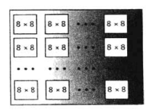

此时每张图片的计算量是单元数的平方，也就是说需要307200<sup>2</sup>次运算，而如果使用JPEG，只需要64<sup>2</sup>次运算

JPEG的整体思想是将图像变换成一个树的线性集合来揭示冗余，这些容易可以通过使用前面学过的无损压缩的方法来出去

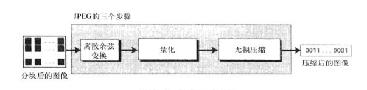

#### 离散余弦变化

在此步骤中，每个64像素块都要使用离散余弦变换，这种变换改变了64个值以使相邻像素之间的关系得以保持

$P(x,y)$定义了每个块上的值，$T(M,N)$则定义了变换后的块的值

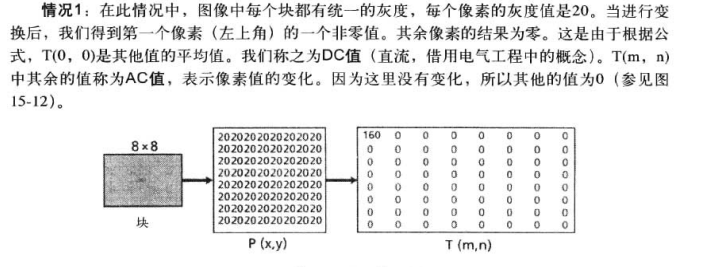

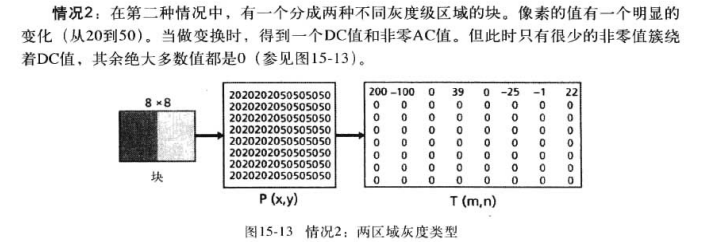

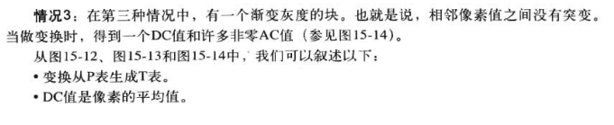

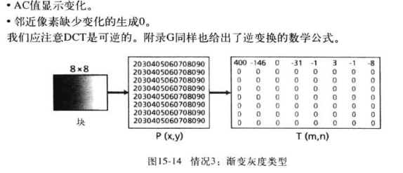

#### 量化

生成T后，这些值将被量化以较少需要编码的位数，量化过程通常用一个常数来除位数，然后舍弃小数部分，这样可以更加减少需要编码的位数

量化阶段是不可逆的，所以称为有损压缩

#### 压缩

量化后，去掉多余的0

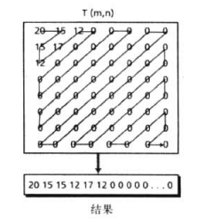

但是为了把0聚集起来，所以歇着读表，而不是按行和列，因为如果图像没有很好地变化，T表底部的右下角将全为0

### 视频压缩MPEG

压缩视频，就是对每一帧空间上的压缩和对一系列帧时间上的压缩

- 空间压缩，每一帧使用JPEG
- 时间压缩，丢弃多余的帧，大多数连续的帧几乎是一样的，例如一个人说话时，除了嘴部其他位置的帧是一样的

通过粗略的估计就可以证明视频时间压缩的需要，一个20:1的JPEG压缩图像每帧需要发送268640位；每秒30帧，也就是11059200位

为了压缩时间数据，MPEG将帧分为三类

- I-帧
- P-帧
- B-帧

**1-帧:**即内部编码帧，是-一个独立帧，该帧与任何其他帧(即在其前发送的帧或者在其
后发送的帧)无关。它们以周期性间隔出现(比如:每9个帧中有一个I-帧)。1-帧必须是周期性出现，因为该帧的突然变化将使得其前面的帧后面的帧不能正常显示。同样，当播放视频的时候，观众可能会随时调整接收机。如果仅仅在播放开始时有一一个1-帧，那么随后调整频的观众将不能收到完整的画面。1-帧 独立于其他帧之外，而且不能由其他帧构造。
**P-帧:** 即预帧，与前面的1-帧或P-帧有 关联。换句话说， 每个P-帧都从 前面帧变 化而来。不过变化不能覆盖大的部分。例如，对于一个快速移动的目标，新变化也许没有记录在P-帧中。P-帧可以通过先前的1-帧或P-帧产生。P-帧携带的信息比其他类型的帧少，而且压缩后会更少。
**B-帧:**即双向帧，与前面和后续的1帧或P-帧有关系。换句话说，每个B-帧都与过去和将来有关系。注意B-帧不会与另一个B-帧有关系。

下图显示了帧的样本序列以及构造过程

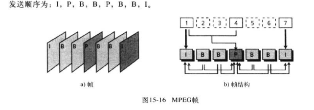

### 音频压缩

音频压缩可以用来处理语音和一月，对于语音我们需要压缩一个64kHz的数字化信号，对于音乐我们需要压缩一个1.411MHz的信号

有两种技术，分别是

- 预测编码
- 感知编码

#### 预测编码

在预测编码中，样本中的差别被编码，而不是所有样本编码

#### 感知编码MP3

感知编码是基于心理声音学的，基于我们听觉系统的下次，有些声音能够掩盖其他声音

在频率掩盖中，一个频率范围的高的声音的可以完全掩盖另一个频率范围内的声音

在时间掩盖中，一个高音可以短时间降低我们听觉的灵敏度