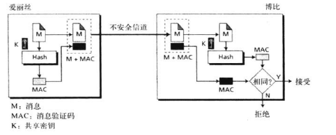

# 安全

## 引言

这一节中，介绍信息安全的总体思想

### 安全目标

安全的三个目标

- 机密性：也就是信息不被未授权访问
- 完整性：不会受到未授权篡改
- 可用性：保持业务的持续可访问操作

### 攻击

三个安全目标会受到安全攻击的威胁

### 安全服务

为了达到安全目标和防止安全攻击，人们定义了安全服务的标准

### 技术

安全目标的真正实现需要一些数学知识，在此书撰写的时候，流行以下两种技术

- 密码学
- 隐写术

#### 密码学

也就是老生常谈的

- 对称秘钥密码
- 非对称秘钥密码
- 散列

#### 隐写术

打过CTF吗？图片隐写就是其中之一

## 对称秘钥密码

对称秘钥密码也就是加密和解密用的是同一个秘钥，如果秘钥被破解，则会被攻击

在对称秘钥密码中，秘钥是至关重要的一环

### 传统密码学

#### 替换密码

用一个符号替换另外一个符号，比如摩斯电码，凯撒密码

#### 置换密码

置换密码是改变符号的位置，也就是CTF常用的栅栏密码等

### 现代对称秘钥密码

常见的有DES和AES

与传统对称秘钥不同的是，传统对应的是字符串，而现代对应的是二进制位

#### DES

数据加密标准(Data Encryption Standard,DES)是美国国家标准技术研究院1997年发布的

#### AES

高级加密标准(Advanced Encryption Standard, AES)是2001年发布的，目的是为了克服DES秘钥长度太短等缺点

## 非对称秘钥密码

引入公钥和私钥的概念

发送者使用接受者的公钥加密文件，接受者接收后用私钥解密文件

最常用的就是RSA算法

RSA算法运用的是超大素数模运算

这里不做深入讨论，将会专门开题来写RSA算法

## 对称秘钥密码与非对称秘钥密码的比较

对称秘钥密码技术基于共享秘密

非对称秘钥密码技术基于个人秘密

### 两个系统的一个共同需要

在对称秘钥密码技术中，符号被置换或替代

在非对称秘钥密码技术中，对数字进行操作

## 其他安全服务

### 消息完整性

主要通过密码散列函数，也就是目前我们经常会去校验的md5

### 消息验证

使用消息验证码(message authentication code , MAC)

### 数字签名

#### 数字签名过程

主要是为了信息的抗抵赖性

发送者使用签名算法来签署信息，消息和签名被发送给接收者，接收者接收到消息和签名，使用验证算法进行验证签名

就像是发送者用私钥签名，其他人用公钥去解密签名来验证

#### 签署摘要

如果消息过长，那么非对称秘钥密码十分低效，所以我们签署消息的摘要，摘要比消息本身要短得多

#### 服务

数字签名提供

- 消息验证
- 消息完整性
- 不可否认性（抗抵赖性）
- 机密性

在这个抗抵赖性的服务下，需要有可信的第三方，不然如果一方私自更改秘钥即可抵赖

### 实体验证

实体验证就是如何去验证自己的权限，就像输入密码才可以登录账户一样

#### 消息验证与实体验证

- 消息验证可能不会实时发生，但是实体验证会
- 消息验证简单的验证一则消息，实体验证可在整个会话期间验证

#### 验证分类

- 所知道：密码
- 所拥有：加密狗
- 所固有：指纹，声音

#### 口令

最基本的验证，也就是我们常常需要输入的密码

#### 质询-相应

在口令验证中，要求通过展示知道的秘密（口令）来验证身份，但是发出口令就容易被嗅探出

质询相应要求访问者证明他们知道秘密，但是不能说出来秘密

在这里可以通过时间戳等，通过访问者运用函数运算，把包含要求者发送来的时间戳根据所知秘钥运算后的结果发送给要求者

#### 零知识

在零知识验证中，访问者不暴露任何信息，只说是\否这样的回复

#### 生物测定

也就是指纹等

## 秘钥管理

### 对称秘钥分发

在对大量消息进行加密时，对称秘钥密码更高效，但是如果一个客户端要与100万个客户端通信，这100万个对称秘钥如何管理

所以建立了秘钥分发中心KDC，每次会话给会话双方分发临时秘钥，会话结束后删除

### 公钥分发

#### 公开声明

已经很脆弱了，不谈了

就像ARP攻击一样

#### 可信中心

每个人发布公钥都要证明其身份

#### 认证机构

也就是CA，建立公钥证书来抗伪造

