# 计算理论

## 简单语言

我们可以仅用三条语句来定义一种语言，他们是

- 递增语句
- 递减语句
- 循环语句

### 递增语句

对变量值+1

```
incr (X)
```

### 递减语句

对变量值-1

```
decr (X)
```

### 循环语句

循环语句是在变量的值不为0时，重复进行一个或一系列动作

```
while (X)
{
	decr(X)
	actions of loop
}
```

### 简单语言的威力

只用这三种简单语句的简单程序设计语言和目前我们使用的任何一种复杂语言一样强大（效率肯定低啦）

#### 简单语言中的宏

我们把每次模拟称为一个宏(macro)，并且在其他模拟中使用时不需要再重复其代码

宏是高级语言中的一条指令，它等价于相同语言中的一条或多条指令的特定集合

##### 宏$X\leftarrow0$

将变量值赋值为0，也称为清空变量

```
while(X)
{
	decr(X)
}
```

##### 宏$X\leftarrow n$

赋值为n

```
X = 0(上文的宏)
incr(X)
..
递增n次
..
incr(X)
```

##### 宏$Y\leftarrow X$

```
Y = 0(上文的宏)
while(X)
{
	decr(X)
	incr(Y)
}
```

##### 宏$Y \leftarrow Y + X$

```
while(X)
{
	decr(X)
	incr(Y)
}
```

##### 宏$Y\leftarrow Y * X$

```
TEMP = Y
Y = 0
while(x)
{
	derc(x)
	Y = Y + TEMP
}
```

##### 宏$Y\leftarrow 	Y^{x}$

```
TEMP = Y
Y = 0
while(x)
{
	derc(x)
	Y = Y * TEMP
}
```

##### 宏if X then A

这里的X只能是0或1，如果X为1则可以执行A

```
while(X)
{
	decr(X)
	A
}
```

#### 输入和输出

在简单语言中，Read X语句可以使用$(X\leftarrow n)$来模拟，也可以模拟输出，即假定程序中使用的最后一个变量保存着将要打印的数据

## 图灵机

### 图灵机的组成部分

图灵机由三部分组成

- 磁带
- 控制机
- 读/写头

#### 磁带

磁带任何时候只能保存一系列顺序字符，该字符来自于计算机所能接收的字符集中、

假设图灵机只能接收两个符号空白b和数字1

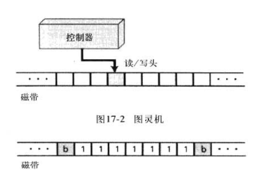

左边的b代表了非负整数的开始，1111111即时非负整数，其他位置皆是b，若还有其他整数，那么需要用至少一个空白字符隔开

同时还假设磁带仅处理一元算数中的正整数，正整数仅由1组成

#### 读写头

每次读完符号后会左移或者右移，读写和移动都是在控制器指令下进行的

#### 控制器

类似于CPU，是一个有限状态的自动机，该机器由预定的有限个的状态并能根据输入从一个状态转移到另一个状态,，假设机器只有ABC三个状态

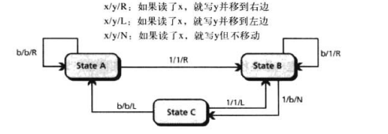

我们可以创建一个类似于指令集的东西

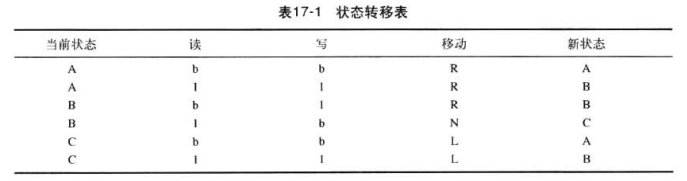

指令是吧一行中的5列指令放在一起，对于这台初级的机器，我们只有6条指令

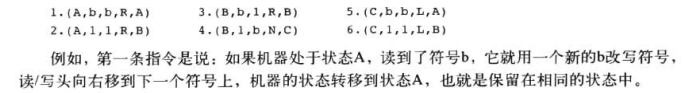

假设一个图灵机只有两个状态和以下四条指令

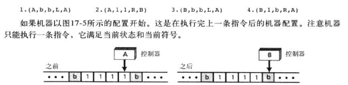

### 对简单指令的模拟

#### 递增语句

下图显示了incr(X)语句的图灵机，空机器有4中状态S1-S4

S1是开始状态

S2是右移状态

S3是左移状态

S4是停机状态

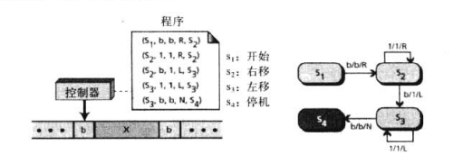

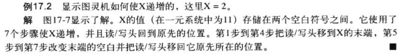

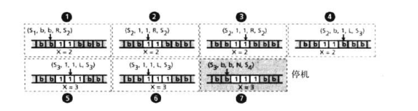

#### 递减语句

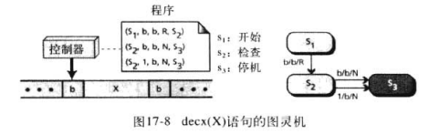

#### 循环语句

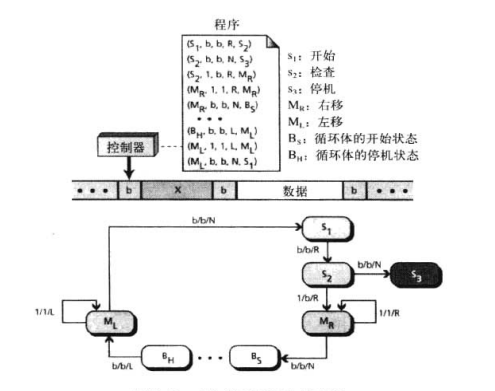

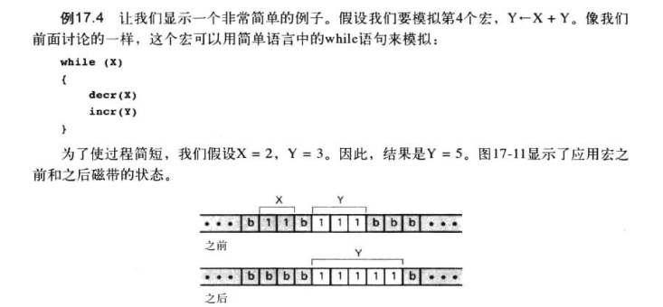


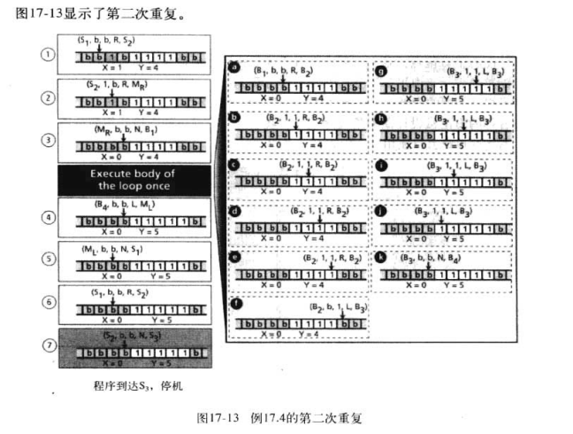

### 邱奇-图灵论题

图灵机能模拟简单语言中的三个基本语句，那就意味着能实现简单语言中定义的所有宏，那么图灵机是否能解决一台计算机能解决的任何问题?

>如果存在一个能完成一个符号操作任务的算法，那么也存在一台完成这个任务的图灵记

不过只是论题，不是定理，但是在属性页上已经证明的计算机模型都与图灵记等价

## 哥德尔数

在计算机科学理论中，一个无符号数能被分配给任何用特定语言编写的程序，这个数被称为哥德尔数

- 程序可以作为单一数据输入项输入给其他程序
- 程序可以通过它的整数表示来引用
- 该编号方式可以用来证明一些问题计算机并不能解决

我们用一个简单的变换给简单语言编写的程序编号，假设简单语言仅使用15个标识符

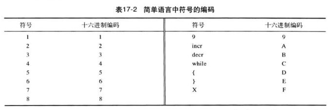

### 表示一个程序

利用这个表，我们可以通过唯一的正整数来表示简单语言所编写的任何程序

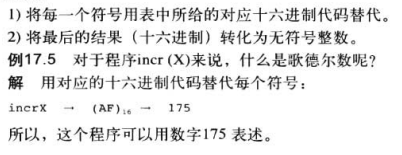

### 翻译一个数组

为了证明编号是唯一的，使用以下步骤翻译

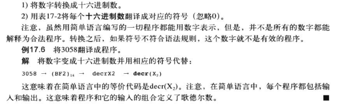

## 停机问题

有些时候会出现死循环

```
x = 1
while(x)
{
}
```

此时无法退出循环

一个典型的问题是，能否通过编写一个程序来测试任何可以用哥德尔数表示的程序是否会终止，这个问题的回答是不能

证明过程如下

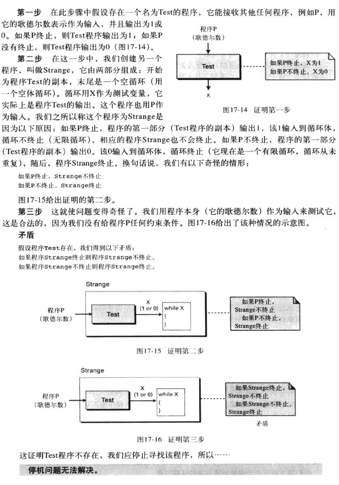

## 可解和不可解问题

一般来书哦计算机科学的问题可以分成两类

- 可解问题
- 不可解问题

### 不可解问题

无法用计算机解决的问题有无穷无尽，停机问题只是其中一个

### 可解问题

我们对于可解问题的关心在于，计算机需要花多久来解决这个问题

衡量的标准由很多，比如运行时间，需要的内存等等

### 可解问题的时间复杂度

也就是数据结构与算法中的大O表示法

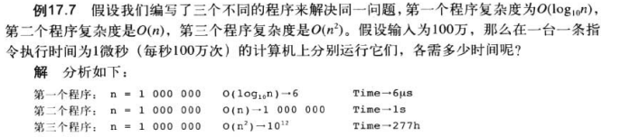