# 人工智能

## 引言

### 什么是人工智能

人工智能是对程序系统的亚久，该程序系统在一定程度上可以模仿人类的活动，如感知、思考、学习和反应

### 人工智能简史

虽然人工智能这一门独立学科还是较为年轻的，但是也发展了一段时间

### 图灵测试

在1950年，阿兰图灵提出了图灵测试，这个测试提出了机器具有智能的一个定义。

该测试的方法是简单比较人类的智能行为和计算机的智能行为，一个询问着对计算机和人类都提出一组问题，然后咨询者得到两组答案，但他不知道哪一组是来自人类，哪一组来自计算机，如果询问者不可以分辨出回答所属的是人类还是计算机，那么计算机就共同改过了图灵测试。

### 智能体

智能体是一个能够智能的感知唤醒、从环境中学习并与环境进行交互的系统

智能体可以分为两大类：

- 软件智能体
- 物理智能体

#### 软件智能体

软件智能体是一组用于完成特殊任务的程序，比如垃圾邮件分类

#### 物理智能体

也就是机器人，用来完成各项任务的可变成系统，比如自动分拣快递，自动焊接臂等

### 编程语言

虽然有些通用语言，如C，C++等可以用来编写智能软件，但是Lisp和Prolog语言是特别为人工智能设计的

不过在2022年的今天，基本上用得都是Python了

## 知识表示

如果打算用AI来解决现实生活的一些问题，那么它必须能够表示知识

四种常见的知识表示方法:

- 语义网
- 框架
- 谓词逻辑
- 基于规则的系统

### 语义网

语义网使用有向图表示知识

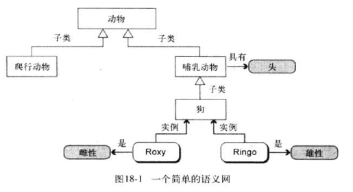

### 框架

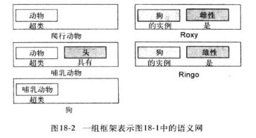

### 谓词逻辑

谓词逻辑可以用来表示复杂的事实

#### 命题逻辑

命题逻辑是对世界进行逻辑推理的一组句子组成的一种语言

##### 运算符

命题逻辑使用五种运算符


真值表

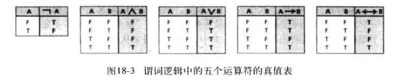

##### 句子

这种语言中的剧组递归定义如下

- 大写字母，比如AB表示自然语言的一个语句，它们是一个句子
- 两个常数值（真和假）中的任意一个都是句子
- 如果P是句子，那么P的非也是句子
- 如果PQ是句子，那么PQ之间的任何关系都是句子

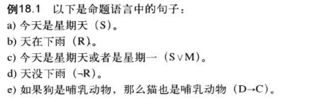

#### 推演

从一直的事实中推导出新的事实的过程叫做推演

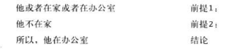

如果我们用H代表在家，O代表在办公室，|-代表所以，那么可以表示成

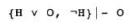

真值表校验

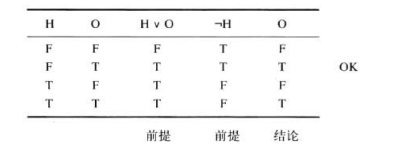

当找不到反例的时候，论断就是非法的

比如

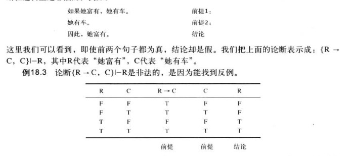

#### 谓词逻辑

在命题逻辑中，表示叫的符号是原子的,我们不能分割开它而发现各个组成部分中所含的信息

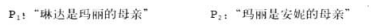

我们不能提取出琳达和安妮之间间的任何关系

例如我们不能推到出琳达是安妮的祖母，要进行这种推导，我们就需要谓词逻辑

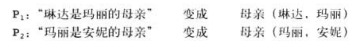

上面句子中的母亲关系是由谓词母亲所定义的，如果玛丽指的是同一个人，那么可以推导出新的关系

```
祖母 (琳达、安妮)
```

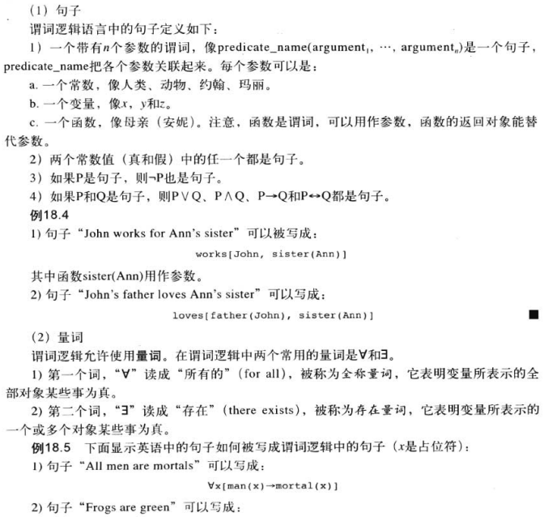

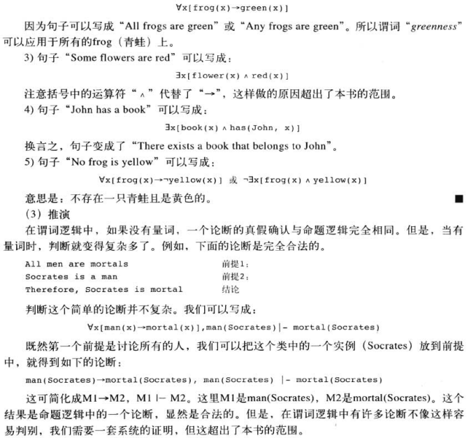

### 超谓词逻辑

由于逻辑推理的需要，逻辑得到了进一步的发展，这些包括

- 高阶逻辑
- 默认逻辑
- 模态逻辑
- 时态逻辑

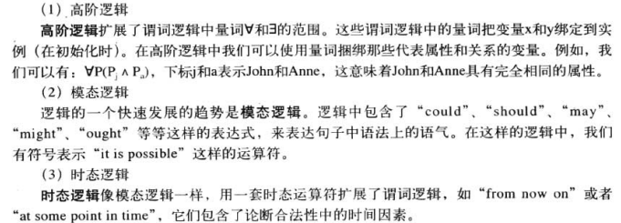

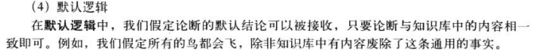

### 基于规则的系统

基于规则的系统使用一组规则来表示知识，这些规则能用来从已知事实中推导出新的事实

形式为


#### 组成

基于规则的系统由三部分构成

- 解释器
- 知识库
- 事实库

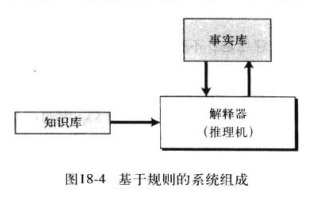

##### 知识库

基于规则系统的知识库部分就是规则的数据库，它包含一组预先建立的规则

##### 事实库

事实库包含了知识库中的规则要使用的一组条件

##### 解释器

解释器是一个处理器，他把规则和事实组合在一起

#### 正向推理

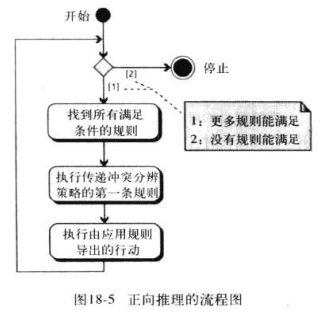

#### 反向推理

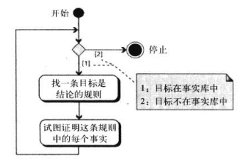

## 专家系统

专家系统是简历在预先定义的相应领域专家经验的基础上的，如医疗专家系统是建立在医学专家的经验上的

### 抽取知识

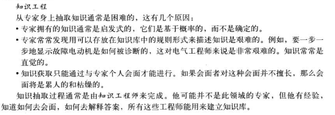

### 抽取事实

#### 体系结构

下图显示了一个专家熊体系结构的背后思想

一个专家系统由7个部分组成

- 用户
- 用户界面
- 推理机
- 知识库
- 事实库
- 解释系统
- 知识库编辑器

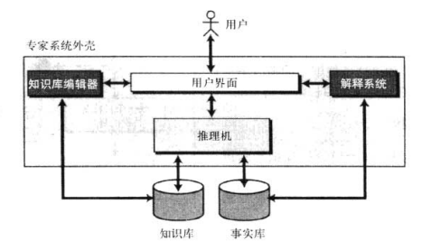

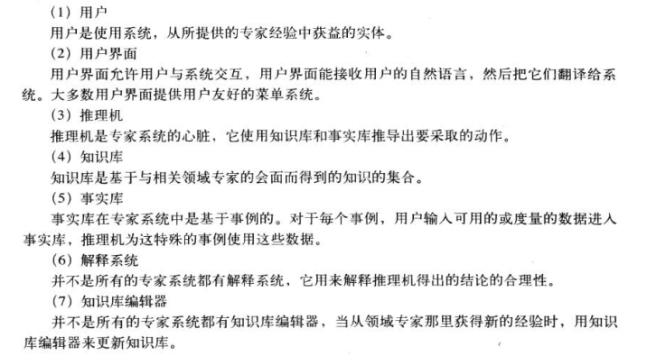

## 感知

人工智能我的一个目标是创建一台行为像爪机的机器，另一个目标是创建一个行为像普通人的机器

目前已经完成了视觉的听觉，触觉应该也已经实现了

### 图像处理

图像处理或计算机视觉是人工智能的一个研究领域

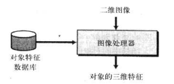

人工智能关系的是如何解释图像

#### 边缘检测

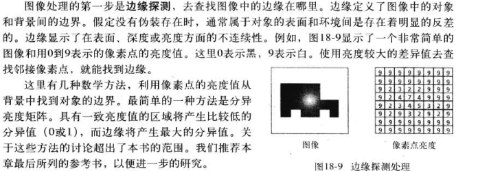

#### 分段

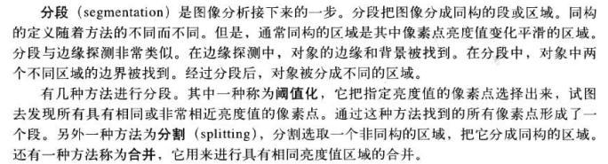

#### 查找深度

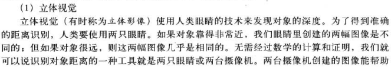

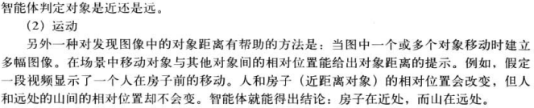

#### 查找方向

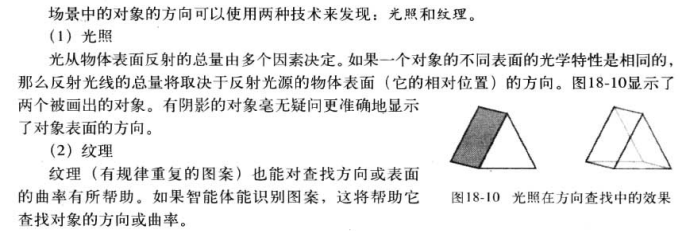

#### 对象识别

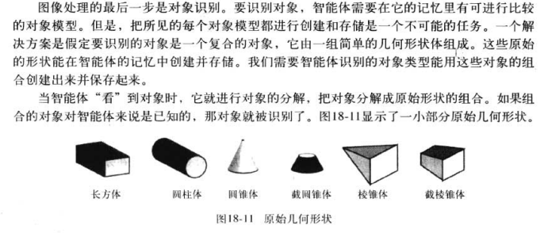

#### 应用

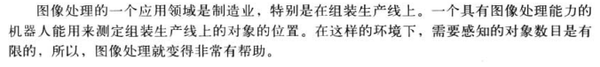

### 语言理解

分为四个步骤

- 语音识别
- 语法分析
- 语义分析
- 语用分析

#### 语音识别

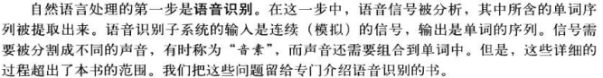

#### 语法分析

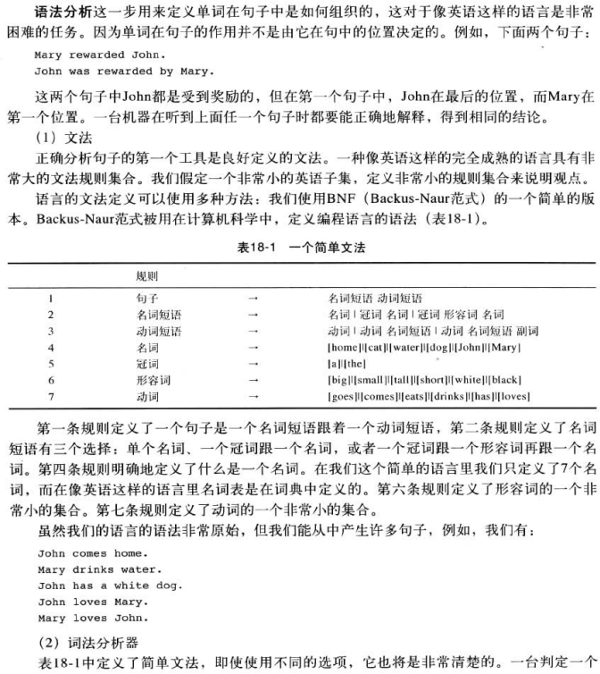

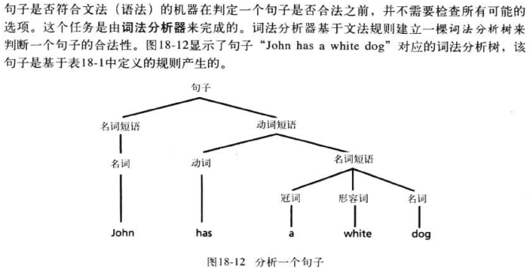

#### 语义分析

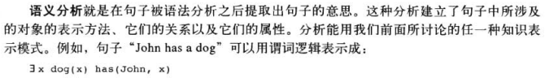

#### 语用分析


## 搜索

搜索方法有两种

- 蛮力搜索
  - 广度优先
  - 深度优先
- 启发式搜索

### 蛮力搜索

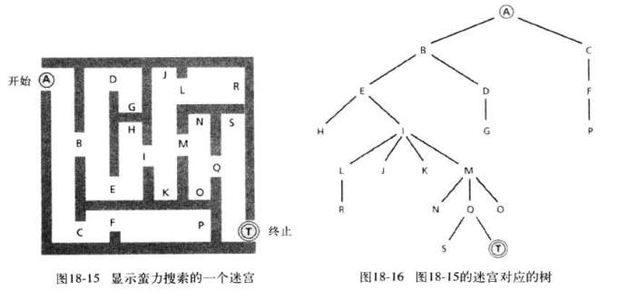

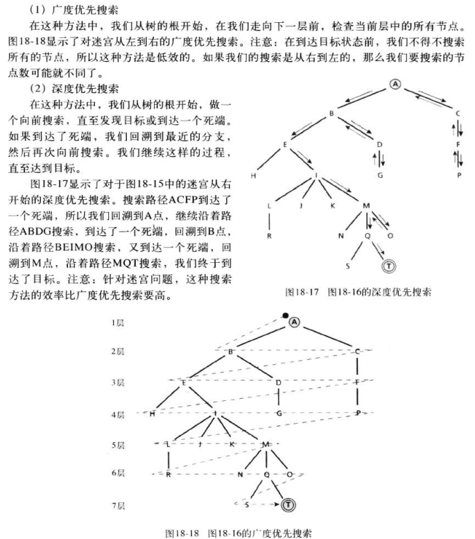

### 启发式搜索

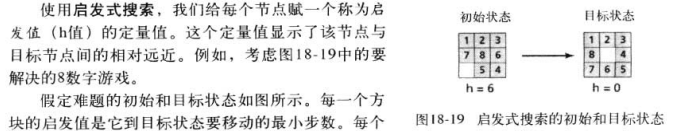

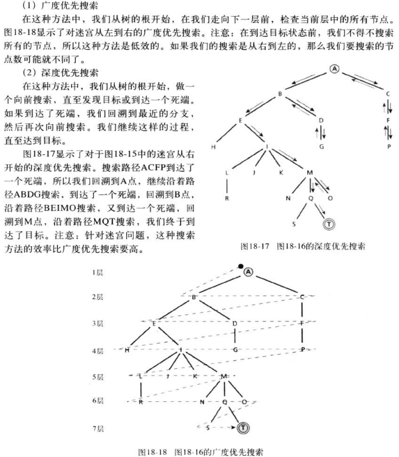

## 神经网络

AI需要学习，学习是一种复杂的生物现象

其中一种方法是神经网络，神经网络试图使用神经元网络去模仿人脑的学习过程

### 生物神经元

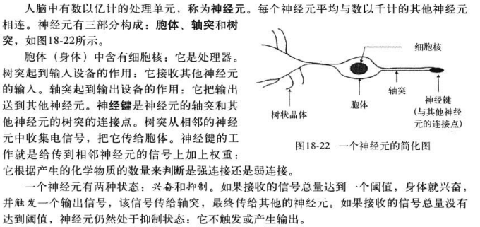

### 感知器

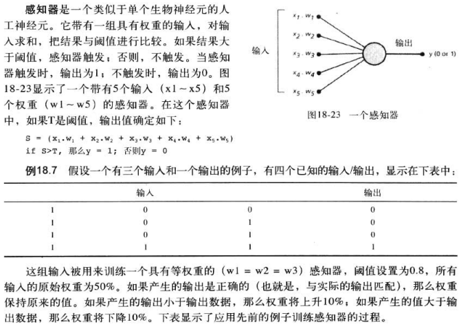

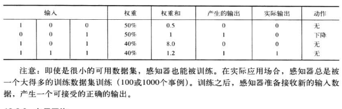

### 多层网络

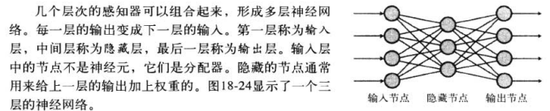

### 应用

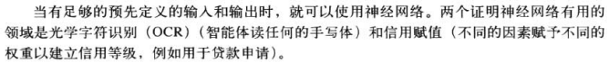