# 数据运算

## 逻辑运算

逻辑运算是指那些应用于模式中的第一个二进制位，在两个模式中相应的两个二进制位的相同基本运算，这意味着我们可以在位层次上或模式层次上定义逻辑运算

模式层次上的逻辑运算是具有相同类型的位层次上的n个逻辑运算，这里的n就是位模式中的位的数目

### 位层次上的逻辑运算

一个位是0或1，假设0代表逻辑假，1代表逻辑真，我们应用布尔代数中定义的运算去操纵二进制位

我们讲述以下四种逻辑运算

#### 非NOT

NOT运算是一种一元运算符，他只有一个输入，输出是输入的相反，比如输入0输出1，输入1输出0

#### 与AND

是二元运算符，有两个输入位

**同真则真，其余为假**

#### 或or

也是二元运算符，有两个输入位

**同假则假，一真则真**

#### 异或XOR

也是二元运算符，有两个输入位

**相同则假，不同则真**

### 模式层次上的逻辑运算

相同的四个运算符（NOT,AND,OR,XOR）可以被应用到n位模式，效果就是对NOT来说，把每个运算符应用于每个位，对于其他三个来说，就是把每个运算符应用于相应的位对

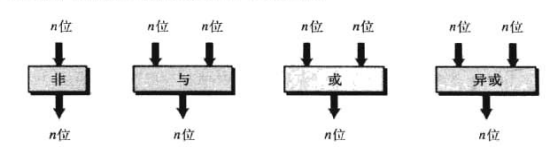

以下为运算示例

这四种逻辑运算可用于修改位模式

####  求反

NOT运算符的唯一应用就是对整个模式求反，把0和1倒置

如上图例4.3

#### 使指定的位 复位（置0）

与运算(AND)的一个应用就是把一个位模式的指定位**复位（置0）**，这种情况下第二个输入称为**掩码**

掩码中的0位对第一个输入中相应的位进行复位，掩码中的1位使得第一个输入中相应的位保持不变

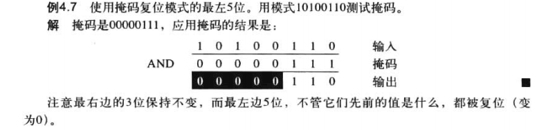

#### 对指定的位 置位（置1）

同上使用掩码，但是使用或运算(OR)

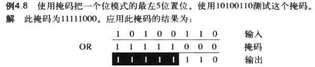

#### 使指定的位反转

使用掩码和异或运算

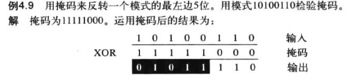

## 移位运算

移位运算移动模式中的位，改变位的位置，它们能向左或向右移动位，共分为两大类

- 逻辑移位运算
- 算数移位运算

### 逻辑移位运算

逻辑移位运算应用与不带符号位的数的模式，因为这些移位运算可能会改变数的符号

#### 逻辑移位

逻辑右移运算把每一位向右移动一个位置，最右位被抛弃，最左位填0

逻辑左移运算把每一位向左移动一个位置，最左位被抛弃，最右位填0

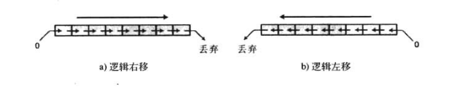

以上举例

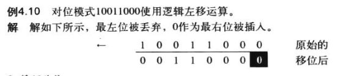

#### 循环移位

循环移位运算（旋转运算）对位进行啊唯一，但没有位被丢弃或增加，循环右移（或右旋转）把每一位向右，最右位到最左

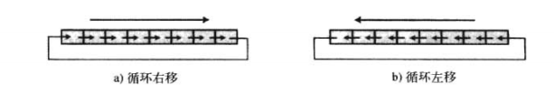

举例说明

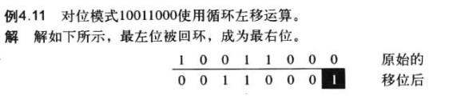

#### 算数移位运算

算数移位运算假定位模式是用二进制补码格式表示的带符号位的整数。

算数右移被用来对整数除以2，而算数左移被用来乘以2

这些运算并不改变符号位（最左位）

算数右移保留符号位，但同时也把他复制，放入相邻的右边的位中

算数左移丢弃符号位，接受它右边的位作为符号位

如果新的符号位与原先的相同，那么运算成功，否则会出现溢出

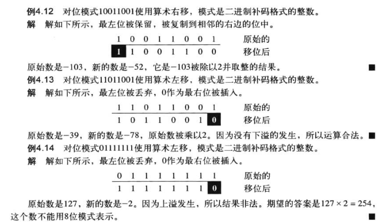

在例4.12中，根据整数的补码存储

位模式10011001实际上是补码存储后的结果

转换后位01100111才是103

运算过程如图

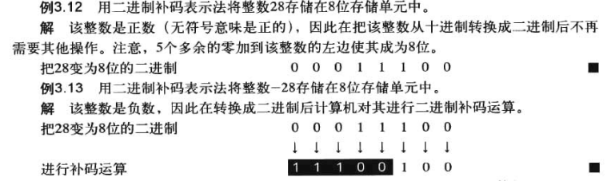

再给出一个非法溢出的案例

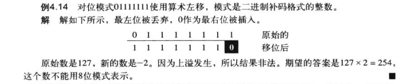

假设有一个模式，在判断过程中需要使用此模式的第三位（从右起）是0还是1，运算过程如下

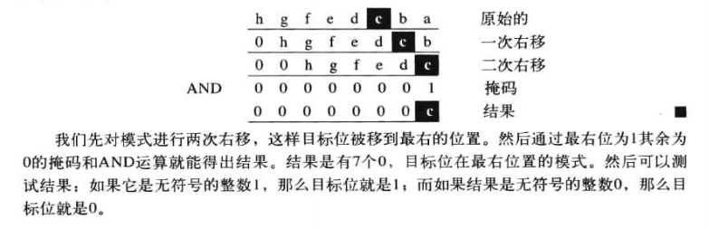

## 算数运算

也就是加减乘除，适用于整数和浮点数

### 整数的算数运算

虽然整数的乘法（除法）能通过重复的加法（减法）来实现，但程序是低效率的，但Booth程序这种高效的超出了本书范围，所以只做加法减法

#### 二进制补码整数的加减法

二进制补码存储的整数的加减法没有区别

当遇到减法运算时，计算机只简单的把它转变为加法，但要为第二个数求二进制的补码

和十进制加法一样，二进制加法也就是相同列相加然后有进位则进到下一列上，但是最后一列的进位被舍弃

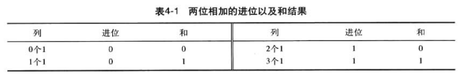

计算A=(00010001)2与B=(00010110)2相加

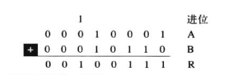

以下为一些示例

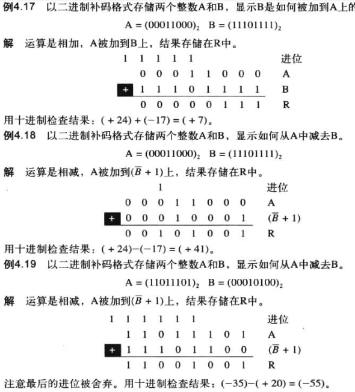

以及一个溢出的例子

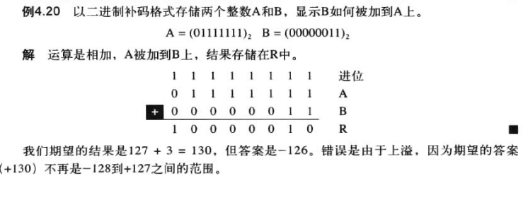

因为此时一共八位，包含一位符号位

七位最大表示1111111也就是127

#### 符号加绝对值整数的加减法

首先请查阅符号加绝对值表示法

其具有四种不同的符号组合（两个符号，每个有两个值）

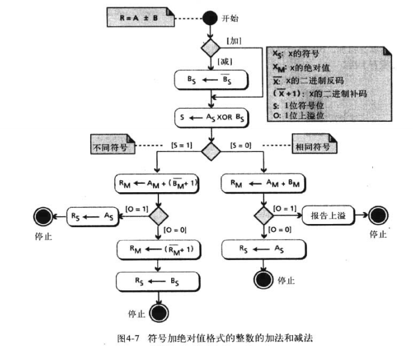

### 实数的算数运算

同样也只有加减运算

过程如图

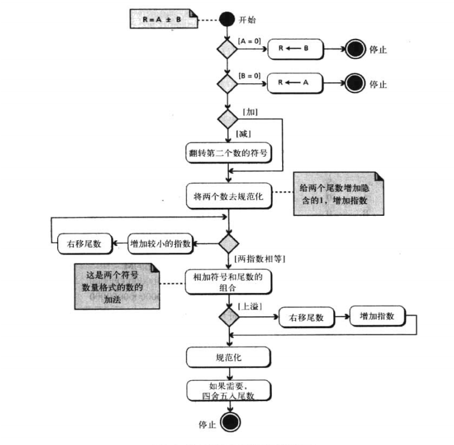

一些运算示例

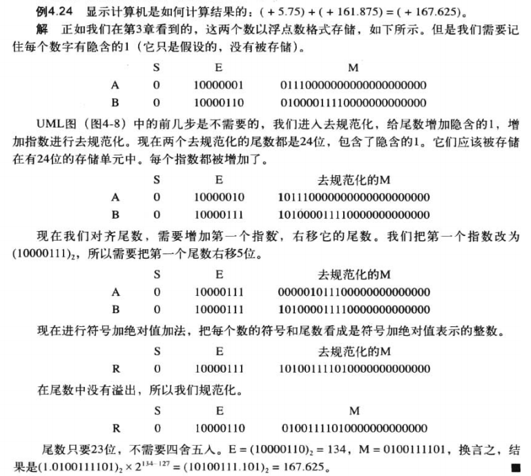

以及整数负数相加

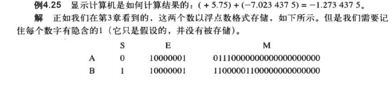

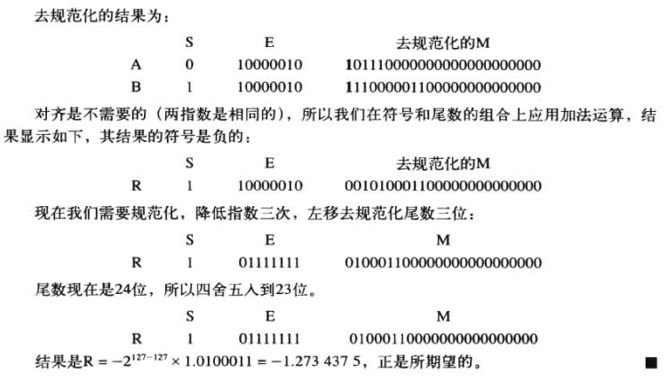