# 计算机网络

## 引言

网络是硬件和软件的组合，它把数据从一个地方发送到另一个地方，硬件是指把信号从网络中的一点传送到另一点的物理设备，软件由指令组成，这些指令使得我你们希望从网络得到服务成为可能

### 网络标准

#### 性能

性能可以使用多种方式度量，包括传输时间和响应时间

**传输时间**是信息从一个设备传输到另一个设备所需的时间总量

**响应时间**是查询和响应的时间间隔

网络的性能依赖于许多因素，比如用户数，传输介质和类型，硬件的连接能力和软件效率等

#### 可靠性

除了发送的准确性，还包括故障的发生率、从故障中恢复的时间、灾难时网络的健壮性等

#### 安全

网络安全问题包括保护数据、防止非授权访问、损坏和修改，实现从数据破坏和数据丢失中回复的策略和程序

### 物理结构

#### 连接类型

网络由两个或两个以上通过链路连接的设备构成，链路是数据从一个设备传输到另一个设备的通信通道

连接的类型有

- 点对点
- 多点

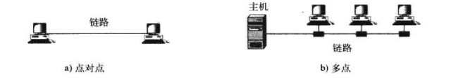

点对点连接提供了两个设备间的专用链路，链路的整个容量为两个设备的传输所拥有

多点连接是两个以上的设备共享一个链路，信道的容量被共享

#### 物理拓扑

四种基本结构是

- 网状型
- 星型
- 总线型
- 环型

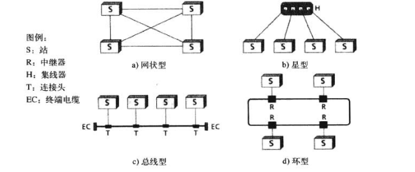

**网状拓扑**中，每个设备都有专用的点对点链路与其他每个设备相连

**星型拓扑**中，每个设备都有专用的点对点电路，通常只与集线器这个中央控制器相连

**总线拓扑**中使用多点链路，一根长电缆（称为总线）起着骨干作用，把所有网络设备连接在一起。节点使用分支线和连接头与总线相连

**环形拓扑**中，每个设备都有专用的点对点链路，只与两边的设备相连，信号只是以一个方向沿着环传输，直到目的主机

**每种拓扑都有其优缺点**

网状拓扑保证每个连接都传输它自己的数据负载，消除了流量问题，如果一条链路损坏，不影响其他网络，在这个意义上，网状拓扑是健壮的，缺点在与电缆的数量和输入输出的接口较多

环形拓扑相对容易安装和重构，但是只要一个站不可用就会导致整个网络的不可用，这个缺点可以使用双环和能隔离断裂的开关来解决，当IBM引入局域网令牌环时，环型拓扑是占主导作用的，如今对高速网络的追求使得这种拓扑不再流行了

总线拓扑安装简单，骨干电缆可以放置在最有效的位置上，然后通过长短不一的分支线与节点相连，但是总线电缆的故障将终止所有传输，即使是问题区域同一边的两个设备之间也不能传输

如今的高速局域网中最常用的是星型拓扑，它比网状拓扑便宜，而且具有网状拓扑的大多数优点，唯一的缺点就是整个拓扑依赖单个点（极限器），如果集线器停机，整个网络就不工作了

### 网络分类

#### 局域网

局域网（LAN）常常是私有的，连接单个办公室，大楼或校园里的设备

LAN是为个人计算机或工作站间的资源共享而设计的，包括PC，打印机等等，其中一台计算机可以用有大容量的磁盘驱动器，它可能称为客服机的服务器，软件存储在这台中央服务器上，提供给全组使用

#### 广域网

广域网（WAN）提供长距离的信息传输，地理上可能包含一个国家甚至全球，WAN可以复杂的像因特网的主干，也可以简单的像家用计算机连接到因特网的拨号线路

骨干WAN是由服务提供商运营的复杂网络，通常连接因特网服务提供商（ISP），比如中国移动，联通等

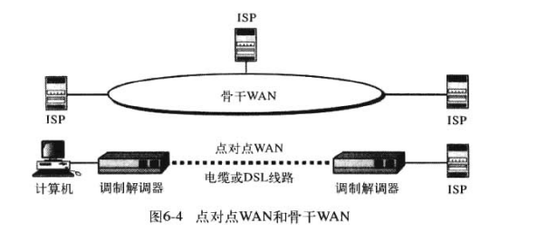

#### 城域网

城域网（MAN）的大小介于LAN和WAN之间，通常覆盖一个镇或一个城市，用来为那些需要高速连接的终端点分布在一个城市或城市的一部分的客户服务，MAN的一个典型例子是提供DSL线路给客户的电话公司的那部分网络，另一个例子是原来为电缆电视设计的电缆网络，如今也被用作因特网的高速数据连接

#### 互联网

如今我们很少见到孤立的网络，网络都是互联在一起的，也就是互联网internet)这里小写i，因为大写的Internet是因特网

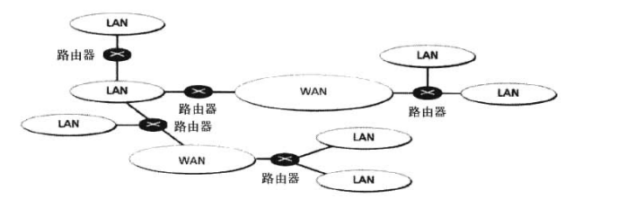

路由器是发送数据包，并使其在互联网中传输的连接设备

#### 因特网

最大的互联网就是因特网Internet，它由无数个互相连接的网络组成

如今大多数需要因特网连接的用户使用因特网服务提供商(ISP)的服务，ISP是具有一台或堕胎通过高速链路连接到因特网的服务器的组织，通过建立服务合同和付费，个体因特网用户或小公司可以连接到本地ISP的服务器上，现在，由国际服务提供商，国家服务提供商，区域服务提供商和本地服务器提供商，如今的因特网由私有公司运营

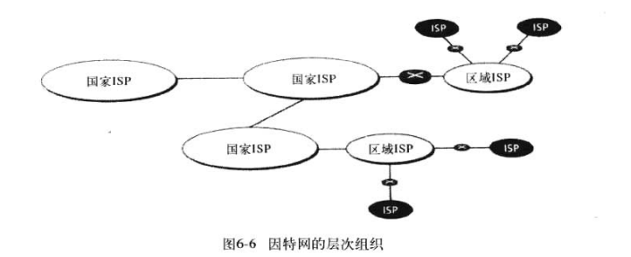

## TCP/IP 协议族

为了分解完成任务所需要的服务，因特网创建了一组规则，称为协议

这些协议允许不同技术的局域网和广域网互相连接到一起，控制因特网的一组协议称为TCP/IP协议

TCP/IP协议分为四层，分别是

- 应用层
- 传输层
- 网络层
- 数据链路层

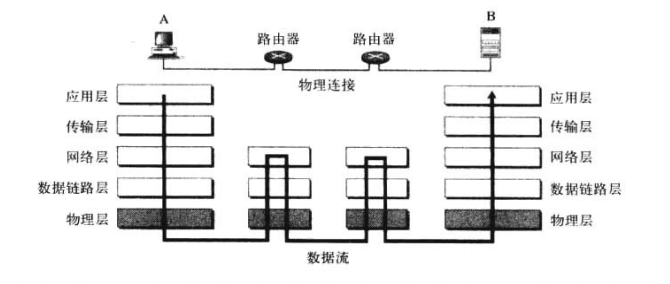

## 层

### 应用层

#### 客户/服务器体系结构

应用层允许用户访问网络，比如电子邮件，远程文件访问和传输等

虽然有两种体系结构，允许运行在两台运城计算机上的程序通信，但客户/服务器体系结构更为常见，另一种体系结构（对等体系结构正在逐渐流行）

客户端程序和服务端程序之间的通信称为进程到进程的通信，因为运行在这种体系结构中的程序称为进程

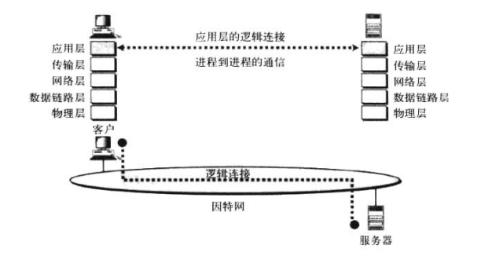

#### 应用层地址

当客户需要像服务器发送请求时，他需要服务器应用层的地址，比如HTTP协议所使用的URL统一资源定位符

每一台计算机都有一个IP地址

服务器应用层地址能够帮助客户端找到服务器的IP地址，客户端进程应该已经知道域名服务器（DNS）的地址，这些服务器将域名匹配到IP地址的目录

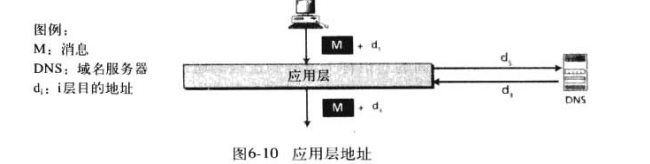

### 传输层

传输层负责的整个消息的进程到进程的传输——建立客户和服务器计算机的传输层的逻辑通信

虽然物理通信是两个物理层间的，但两个应用层把传输层看成是负责消息传输的代理

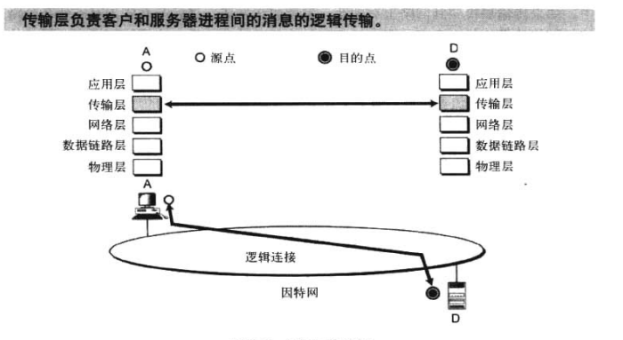

#### 传输层的地址

也就是端口号，用于使用不同的进程来处理数据


#### 多路复用和解多路复用

传输层的一个职责就是多路复用和解多路复用，类比我们的城市，在大城市，人们生活在大的公寓大楼中。邮递员无法从每个住户那里收集邮件，并把每个邮件分发到每个住户。这个职责通常有门卫来完成，门卫从住户那里收集要发出的邮件，把它们发送给邮递员，这就是多路复用。并且将收到的邮件分发给用户，这就是解多路服用。

传输层为不同的进程做相同的工作，他从进程中收集要发出的信息。并将到达的信息分发给进程。传输层使用端口号完成多路复用和解多路复用。

#### 拥塞控制

传输层负责实现拥塞控制，物理上传送数据包的下层网络可能发生的交通拥塞。这可能引起网络丢弃一些数据包。有些协议为每个进程使用缓冲区，消息在发送前缓存在缓冲区中如果传输层检测到网络上有拥塞，它就暂停发送

#### 流量控制

传输层还负责流量控制。发送端的传输层，能监控接收端的传输层，检查接受者接收的数据包是否过量。如果系统使用从接收者发出的确认这个可以实现。收者确认每个数据包括一组数据包，这样就允许发送者检查接收者接收到的数据包是否过量。

#### 差错控制

在消息的传输过程中，他有可能损坏，丢失，重复或乱序。传输层的发送负责确保消息被目的传输层正确接收。上面描述的确认系统也能提供差错控制，传输层可以在缓冲区中保留消息的副本，直到他接受者那里收到包无损坏到达和次序正确的确认。

如果在预期的时间内没有确认到达或否认确定到达，那么发送者就重新发送数据包，为了能够检查包的次序，传输中给每个包加上了次序号，给每个确认加上了确认号。

#### 传输层协议

在TCP/IP协议族中，定义了三种传输层协议

- TCP
- UDP
- SCTP

##### UDP

UDP(用户数据报协议)，是三个协议中最简单的。

UDP完成多路复用，和解多路复用通过给数据包增加源和目的端口号。他还通过给包增加校验和来进行差错控制

在这种情况下，差错控制只是是或否的过程，接受者重新计算校验和，检查在传输中是否有差错发生。如果接收者得出结论，这个包被损坏，他只是默默地丢掉这个包，而不发通知发送者重新发送。UDP不是完美的协议，但当其他职责不是传输层所需要的，或这些职责已由应用层完成时，它非常有用。UDP的简单使其具有速度快的优点，UDP的效率也很高。

因为UDP不提供属于单个消息的数据包间的逻辑连接，所以被称为无连接协议

##### TCP

TCP(传输控制协议)是支持传输层所有职责的协议，但是他没有UDP快和高效。

TCP使用序号，确认号和检验和。在发送方还使用缓冲区。这种配置提供了多路复用，解多路复用，流量控制，拥塞控制和差错控制。

因为TCP在两个传输层间提供逻辑连接，所以被称为面向连接的协议，一个在源端，另一个在目的端。序号的使用维持连接：，如果数据包到达的顺序错了或丢失了，将被重新发送。

在接收端的传输层，不把次序错的数据包发送的应用进程，但保留消息中的所有数据包，直到他们以正确的次序被接收。

虽然TCP是数据通信中完美的传输层协议，但它不适合音频和视频的实时传输，如果数据包丢失TCP需要重新发送，这样就破坏了数据包的同步。

##### SCTP

SCTP(流控制传输协议)是一个新的协议，他是为了一些预期的因特网服务而设计的，如因特网，电话和视频流。这个协议结合了UDP和TCP的优点。

### 网络层

网络层负责源到目的地的数据包发送，它可能跨多个网络，网络层保证每个数据包从源点到最终目的地。

**网络层负责单个数据包从源主机到目的主机的发送**

除了多路复用和解多路复用以外，希望从网络层得到服务与上面提到的完美传输层服务相似，网络层协议应该提供拥塞控制，可流量控制和差错控制。但是这在因特网中不现实。

#### 网络层地址

从客户端到服务器的数据包和从服务器返回的数据包需要网络层地址。服务器的地址由服务器提供完，客户端的地址是客户端计算机所知道的

网络层使用它的路由表，找到下一跳路由器的逻辑地址，把这个地址传递给数据链路层，使用数据链路层需要的这个逻辑地址，来找到下一个路由器的数据链路层地址


#### 路由选择

网络层有一个特殊的职责：路由选择

路由选择是指确定数据包的部分或全部路径。因为互联网比较大，因此从源到目的地址的数据包可能是几个发送的组合：源从路由器的发送、几个路由器到路由器的发送，最后是路由器到目的地的发送。

当一个路由器接收到一个数据包时，他检查路由表，决定这个数据包最终的目的地的最佳路线。路由表提供了下一路由器的IP地址。当数据包到达下一路由器时，下一路由器再做出新的决定。

下图显示了经过几个网络从源到目的地指的数据包的路由选择

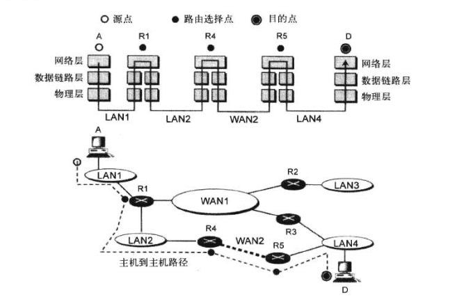

路由器通过路由器选择协议（RIP OSPF BGP）来更新

#### 网络层协议

TCP/IP 协议族支持一个主协议（IP）和几个辅助协议，帮助IP完成任务

##### IP

在TCP/IP中，网络层的主协议是因特网协议（IP）

IPV4协议使用32位的IP地址标识，采用点分十进制表示法，将IP地址分为4位0-255的整数

例如IPV4地址

```
00001010 000011001 10101100 00001111
```

用点分十进制写为

```
10.25.172.15
```

在消息的源头，IPV4协议把源和目的地址加到从应用层传来的数据包中，数据包然后准备传输，实际的传输是数据链路层和物理层实现的

IPV4的地址范围可以定义2<sup>32</sup>个不同的设备，但是过去的地址分配产生了地址损耗，如今的解决方案是IPV6

IP提供了尽力而为的服务，不保证数据包无误到达或者是按照希望的顺序到达，也不保证任何数据包都被发送，因此我们使用TCP等协议来弥补

##### 辅助协议

ICMP协议可以用来报告一定数目的差错给源计算机，例如数据包因为网络拥堵丢失了一个，ICMP可以发送一个数据包给原服务器，警告他拥堵，ICMP还可以用来检查因特网节点的状态

因特网小组管理协议（IGMP）用来增加IP的多播能力，IP本质上是单播的协议，一个源一个目的地之，多播传输是指一个源，多个目的地

其次还有ARP（地址解析协议）和RARP协议来复制

### 数据链路层

从一个节点到另一个节点传送数据的是数据链路层

在源数据包应该发送到路由器R1后，它用数据帧封装数据包，在包头增加路由器R1的数据链路层地址作为目的地址（也就是MAC地址），计算机A的数据链路层地址作为源地址，然后发送数据包，每个连接到LAN1的设备都接收到数据帧，但只有R1打开它，因为它认出它的数据链路层地址

这个过程在R1和R4、R4和R5、R5和D之间重复

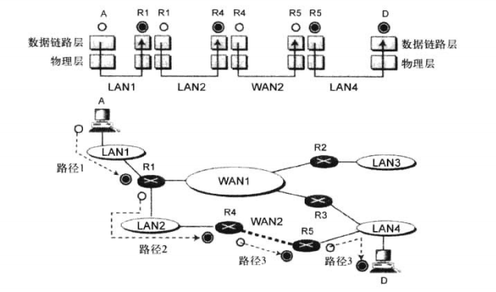

#### 数据链路层地址

也就是MAC地址

计算机A是如何直到路由器R1的数据链路层地址的

一个设备可以静态或动态地找到另一个设备的数据链路层地址

在静态方法中，设备创建具有两列的表，用于存储网络层和数据链路层的地址对

在动态方法中，设备可以广播一个含有下一跳设备IP地址的特定数据包，并用这个IP地址询问邻近节点，邻近节点返回它的数据链路层地址

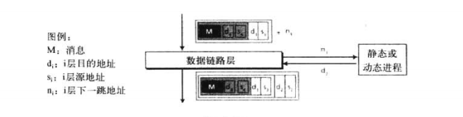

与IP地址不同，MAC地址不是通用的，每个数据链路协议可能使用不同的地址格式和大小

以太网协议使用48位协议，通常被写为16进制格式，如

```
08:01:02:11:2C:5B
```

MAC地址全称 **介质访问控制地址**

#### 差错控制和流量控制

方法与传输层的相同，但是只能实现节点和节点之间的，这意味着差错会被检查多次

从头到尾的检查由传输层实现


### 物理层

物理层实现了在物理介质上传输二进制流所需要的功能

负责将组成帧的单个二进制位从一个节点到另一个节点的传送

帧中的每个位被化为电磁信号，通过物理介质（无线或电缆）传播

物理层不需要地址，传播方式是广播

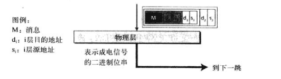

### 总结

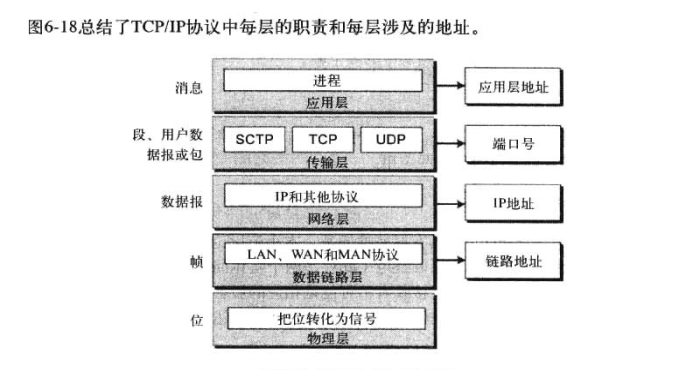

过程如下，层级封装

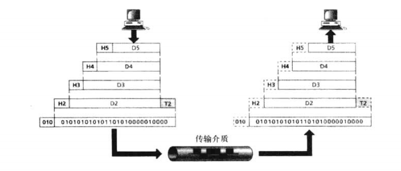

## 因特网应用

这一章写的很水，我觉得没必要拿出来做笔记了，就是介绍一下FTP.SMTP等等协议的应用，没有深入的东西

整体来说计算机网络这一章可能是因为本人了解的较多的缘故，感觉内容很浅
