# 软件工程

## 软件的生命周期

软件的生命周期是软件工程中的一个基础概念，软件和其他产品一样，重复性地重复着一些阶段

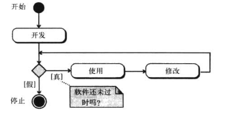

### 开发过程模型

开发过程包括4个阶段

1. 分析
2. 设计
3. 实现
4. 测试

#### 瀑布模型

在瀑布模型中，开发过程只有一个方向的流动，这意味着前一个阶段不结束，后一阶段不能开始

优点是下一阶段开始的时候，上一阶段已经完全完成，下一步的工作明确

缺点是难以定位问题，如果过程的一部分有问题，必须检查整个过程

#### 增量模型

开发者首先完成整个系统的简化版本，不包括具体细节

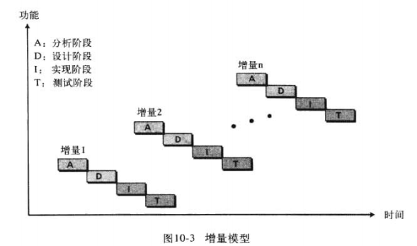

在第二个版本中，更多的细节被加入

## 分析阶段

### 面向过程分析

分析阶段使用的方法

#### 数据流图

数据流图显示了系统中数据的流动

- 方盒型表示数据源或数据目的
- 带圆角的矩阵表示过程
- 末端开口的矩形表示数据存储
- 箭头表示数据流

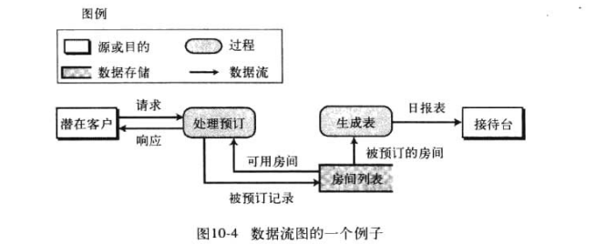

#### 实体关系图

因为也用于数据库的设计，所以将在第12章讨论，当前是第10章

#### 状态图

它通常用于当系统中的实体状态在响应事件时将会改变的情况下

我们以单人电梯我的操作为例

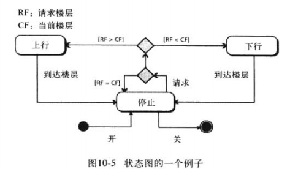

### 面向对象分析

#### 用例图

用例图给出了系统的用户视图，显示了用户于系统间的交互

用例图使用四种组件

- 系统
- 用例
- 动作者
- 关系

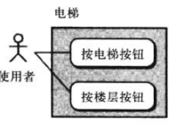

#### 类图

分析的下一步就是创建系统的类图

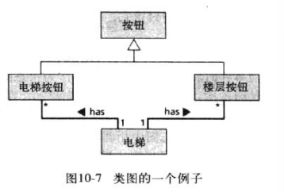

#### 状态图

类图完成后，就可以为类图中的每个类准备状态图

## 设计阶段

设计阶段定义系统如何完成在分析阶段所定义的需求，在设计阶段，系统所有的组成部分都被定义

### 面向过程设计

在面向过程设计中，既要有设计过程，也要有设计数据

整个系统被分解成一组过程或模块

#### 结构图

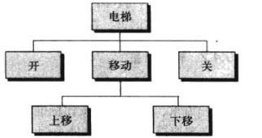

#### 模块化

模块化意味着将大项目分解成较小的项目

内聚性是程序中处理过程相关紧密程度的度量

耦合性是不同的模块之间紧密程度的度量

我们进行设计时要遵循高内聚低耦合的设计理念

### 面向对象设计

在面向对象设计中，设计阶段通过详细描述类的细节来继续

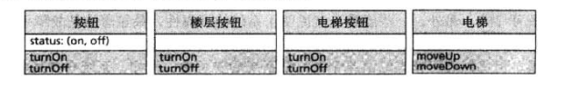

## 实现阶段

### 语言的选择

这个看项目，在如今，Web项目通常会选择Java

### 软件质量

软件质量可以划分成三个广义的度量

- 可操作系
- 可维护性
- 可迁移性

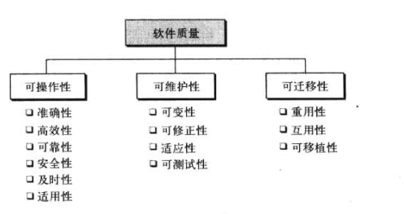

## 测试阶段

通常有黑盒测试和白盒测试

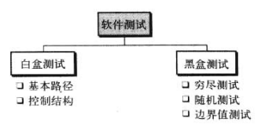

### 白盒测试

与渗透测试一样，白盒测试可以看到软件相关的代码等

白盒测试至少保证满足以下四条标准

- 每个模块中的所有的独立的路径至少被测试过一次
- 所有的判断结构（两路或多路）每个分支都被测试
- 每个循环被测试
- 所有数据结构都被测试

#### 基本路径测试

基本路径测试创建一组测试用例，这些用力执行软件中的每条语句至少一次

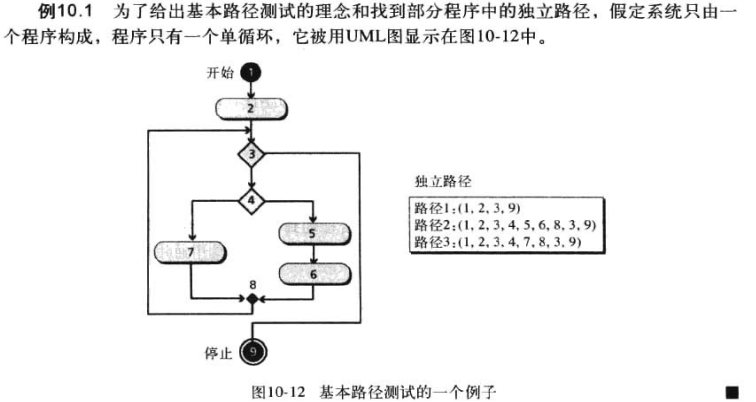

#### 结构控制测试

结构控制测试比基本路径测试更容易理解

##### 条件测试

适用于模块中的任何条件，简单条件是关系表达式，而复合条件是简单条件和逻辑运算符的组合，条件测试用来检查是否所有的条件都被正确设置

##### 数据流测试

数据流测试是基于通过模块的数据流的，这种测试选择测试用例，这些用力设计检查被用在赋值语句左边的变量的值

##### 循环测试

循环测试使用测试用例检查循环的正确性

### 黑盒测试

黑盒测试时测试人员看不到程序是如何工作的

#### 穷尽测试

最好的黑盒测试方法就是用输入域中的所有可能的值去测试软件。但是在复杂的软件中，输入域是如此巨大

#### 随机测试

选择输入域的子集来测试

#### 边界值测试

使用边界值去测试功能

## 文档

为了使软件包正常运行，传统上称为用户手册的文档对用户来说是必不可少的

