# 数据库

## 引言

数据的存储传统上是单独没有关联的文件，有时称为平面文件，这些平面文件组成了一个实体——数据库

### 定义

数据库是一个组织内被应用程序使用的逻辑相一致的相关数据的集合

### 数据库的优点

#### 冗余较少

平面文件中存在大量的冗余，比如关于一个大学的平面文件中，教授的姓名和学生存储在多个文件中

#### 避免不一致性

如果相同的信息被存储在多个地方，那么对数据的任何修改都需要在数据存储的所有地方进行

#### 效率

数据库通常比平面文件的效率要高得多，因为数据库中信息存储在更少的地方

#### 数据完整性

因为数据库中信息存储在更少的地方，更容易维护信息的完整性

#### 机密性

如果数据库是集中存放在一个地方，这就更容易维护其机密性

## 数据库管理系统

数据库管理系统DBMS是定义，创建，维护数据库的一种工具，DBMS也允许用户来控制数据库中数据的存取

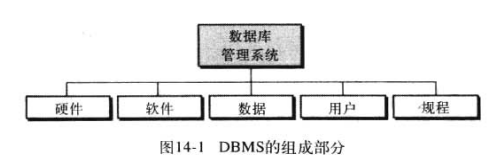

### 硬件

硬件指允许物理上存储数据的计算机硬件系统，比如用户终端，硬盘等

### 软件

软件指允许用户存取、维护和更新物理数据的实际程序

### 数据

数据库中的数据存储在物理存储设备上。数据是独立于软件的一个实体

### 用户

最终用户和应用程序

#### 最终用户

指直接从数据库中获取信息的用户，分为管理员用户和普通用户

#### 应用程序

应用程序需要存取和处理数据

### 规程

数据库管理胸痛的最后一个部分就是必须被明确定义并由数据库用户遵循的规程或规则的集合

## 数据库体系结构

数据库共有三层结构

- 内层
- 概念层
- 外层

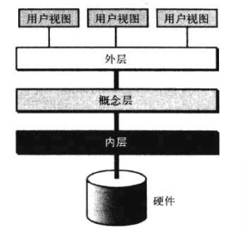

### 内层

内层决定了数据在存储设备中的实际存储位置。这个层次处理低层次的数存取方法和如何在存储设备间传输字节，也就是与硬件交互

### 概念层

概念层也称公用层定义数据的逻辑视图，该层中定义了数据模式，数据库管理系统的主要功能都在该层

### 外层

外层直接与用户交互，将来自概念层的数据转化为用户所熟悉的视图

## 数据库模型

数据库模型定义了数据的逻辑设计

- 层次模型
- 网状模型
- 关系模型

### 层次模型

在层次模型中，数据被组织成一颗倒置的树

每一个实体可以有不同的子节点，目前该模型已经被淘汰

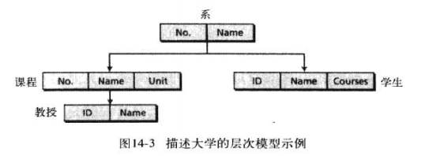

### 网状模型

在网状模型，实体通过图来组织，同样也已经过时

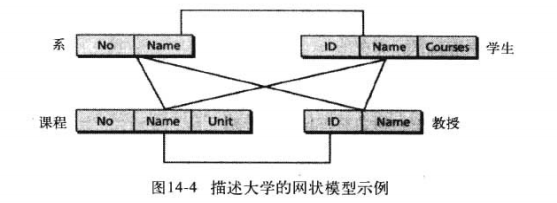

### 关系模型

关系模型中，数据组织成称为关系的二维表，这里没有任何层次或网络结构强加于数据上，但表或关系相互关联

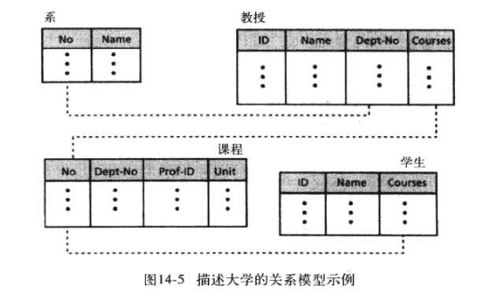

## 关系数据库模型

在关系数据库管理系统(RDBMS)中，数据通过关系的集合来表示

关系数据库管理系统中的关系有下列特征

- 名称，在关系数据库中，每一种关系具有唯一的名称
- 属性，关系中的每一列都称为属性
- 元组，关系中的行称为元组

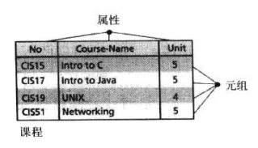

## 关系的操作

包括

- 插入
- 删除
- 更新
- 选择
- 投影
- 连接
- 并
- 交
- 差

### 结构化查询语言

也就是SQL语言

#### 插入

插入是一元操作，语句如下

```sql
INSERT INTO (column_name) VALUES (value)
```

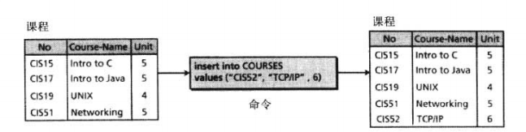

#### 删除

删除元组

```sql
DELETE FROM table_name WHERE ....
```

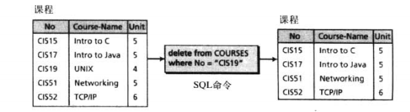

#### 更新

```sql
UPDATE table_name SET column_name=value WHERE ...
```

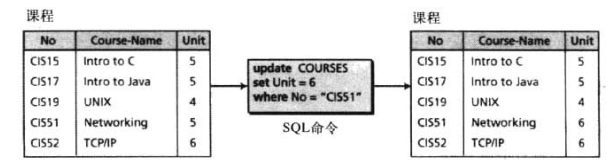

#### 选择

```sql
SELECT * FROM table_name WHERE ...
```

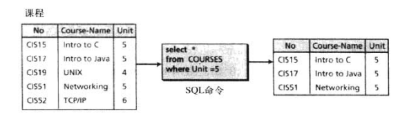

#### 投影

即查询指定字段内容

```sql
SELECT Sname,Sno FROM column_name WHERE 
```

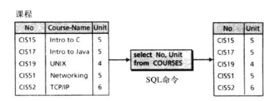

#### 连接

查询两个表中的数据

```sql
SELECT attribute_list FROM table1,table2 WHERE ...
```

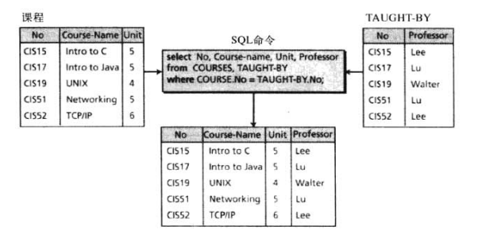

#### 并

也就是联合查询

```sql
SELECT * FROM table1 UNION SELECT * FROM table2
```

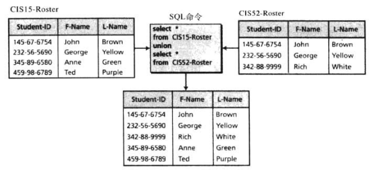

#### 交

两个关系必须由相同的属性

```sql
SELECT * FROM table1 intersection SELECT * FROM table2
```

其实就是jion，这个语句淘汰了

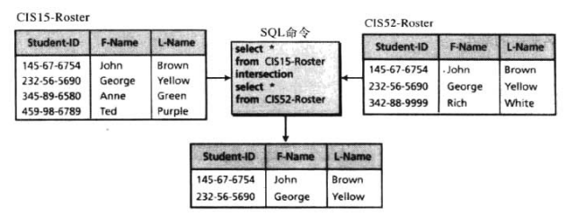

#### 差

```sql
SELECT * FROM table1 minus SELECT * FROM table2
```

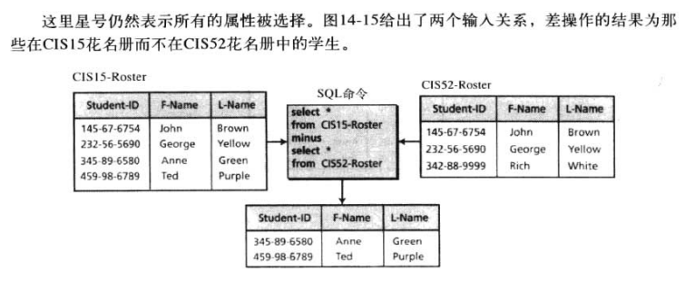

#### 语句的组合

SQL语句可以组合，比如

```sql
DELETE FROM table1 WHERE id IN (SELECT id FROM table1 WHERE class=3)
```

## 数据库设计

数据库的设计师一个冗长且只能一步步完成的工作

第一步是收集相关信息，第二步就是建立实体关系模型

### 实体关系模型

- 矩形表示实体集
- 椭圆形表示属性
- 菱形表示关系集
- 线连接属性和实体以及实体集和关系集

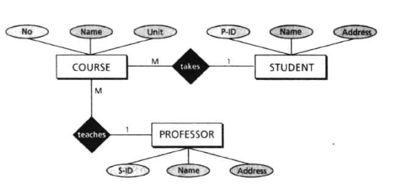

这里的1-M表示一对多的关系

### 从ER图到关系

创建关系（表），然后属性作为列

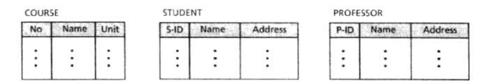

### 规范化

规范化过程定义了一组层次范式，范式有1NF、2NF等

#### 第一范式(1NF)

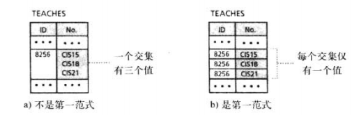

#### 第二范式(2NF)

多出了主键的概念

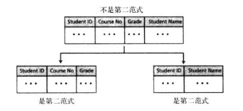

## 其他数据库模型

### 分布式数据库

分布式数据库模型实际上并不是一个新的模型，是基于关系型的

建立在网络通信的计算机上，每台计算机拥有部分或全部数据库

#### 不完全的分布式数据库

比如一个医药公司在许多城市拥有多个站点，每个站点有一个数据库，存储着自己的信息，但是中心部门可以访问控制所有数据库

#### 复制式的分布式数据库

每个站点都有其他站点的一个完全副本，这样数据库的稳定性就会加强

### 面向对象数据库

面向对象数据库在试图保留关系型数据库的有点的同时允许应用存储结构化数据

通常用作面向对象数据的查询语言是xml